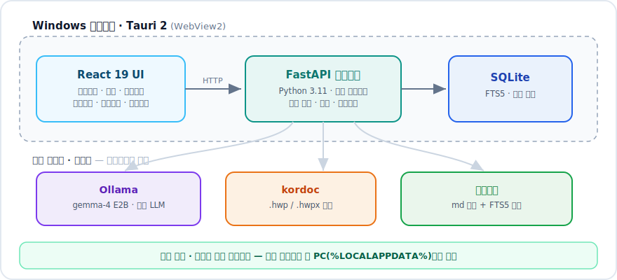

<div align="center">

# 로컬 AI에이전트 워크플레이스 : 공무원

**인터넷 없이, 내 PC 안에서 도는 공무원 업무 AI 워크스페이스**
_대화 · 지식 · 문서가 한 몸으로 — 로컬 경량모델 하나로_


### [⬇️ 설치 패키지 받기](https://github.com/Kminer2053/gongmuwon/releases/latest) · [📖 사용 설명서 보기](https://kminer2053.github.io/gongmuwon/manual/gongmu-user-manual.html) · [🎬 시연 보기](#-시연)

<sub>설명서는 [파일로 내려받을 수도 있습니다](https://github.com/Kminer2053/gongmuwon/releases/download/v0.1.12/Gongmu_User_Manual_KO_v0.1.12.html) — 인터넷이 안 되는 PC에서 열어볼 때 (HTML 한 파일, 그림 포함)</sub>

</div>

---

## 🎬 시연

**대화 한 줄 → 일정 등록 → 내 지식폴더에서 근거 찾기 → 한글 보고서 완성**, 13초로 먼저 보세요.

<div align="center">


</div>

<br>

<!-- README 는 소스의 줄바꿈을 <br> 로 바꾸지 않는다(공백으로 이어붙는다).
     한 줄이 길어지면 GitHub CSS 에 word-break:keep-all 이 없어 '재생하세/요' 처럼
     한글이 단어 속에서 끊긴다. 줄은 <br> 로 직접 나누고 짧게 유지할 것. -->
위 3장면에 더해 **지식위키 구성 · 일정 알림 · 로컬 LLM 설정**까지 —<br>
전체 흐름을 담은 **1분 26초 영상**입니다. ▶ 를 눌러 보세요.

https://github.com/user-attachments/assets/e9f8339c-1b5a-49db-ba5f-2060dff35411

<div align="center">

편집·자막 외 화면은 모두 실제 동작입니다 · [영상 파일 내려받기](https://github.com/Kminer2053/gongmuwon/blob/main/docs/assets/demo.mp4)

</div>

## 이런 상황, 익숙하신가요?

> 🔒 **"AI 좀 써보고 싶은데, 내부 자료를 올릴 수가 없다"** — 폐쇄망이라서, 보안이라서.
>
> 🗂️ **"작년에 그 지침 어디다 뒀더라"** — 폴더를 20분째 헤매는 중.
>
> 📄 **"내용은 다 있는데 서식 맞추는 데 반나절"** — 개조식, 붙임, 끝.

**공무원**은 이 세 가지를 한 화면에서 풉니다. 그리고 **자료는 PC 밖으로 한 줄도 나가지 않습니다.**
인터넷이 끊긴 자리에서도 AI가 돕니다 — 모델이 내 PC 안에 함께 설치되기 때문입니다.

## 한눈에 보기

| | |
|---|---|
| **누&#8288;구&#8288;를 위&#8288;한 것** | 폐쇄망·보안 환경의 공공기관 사무업무자 |
| **무&#8288;엇&#8288;을 하&#8288;나** | 업무대화로 요청 → 내 지식폴더에서 근거를 찾아 답 → 그 대화를 그대로 HWPX 문서로 |
| **어&#8288;디&#8288;서 도&#8288;나** | Windows 10/11 x64 데스크톱. **인터넷 불필요**(로컬 LLM 동봉) |
| **AI 모&#8288;델** | 로컬 Ollama의 `gemma-4 E2B`(멀티모달). 외부 API도 선택 가능 |
| **데&#8288;이&#8288;터 저&#8288;장** | 전부 내 PC. 지식폴더는 지정한 업무 폴더를 **그 자리에서** 색인(복사·업로드 없음) |
| **비&#8288;용** | 앱·모델 모두 무료. 계정 가입도, 결제도 없음 |

## 이렇게 씁니다

1. **물어봅니다** — "다음 주 AX 전략 회의 준비 자료 정리해줘"
2. **근거와 함께 답합니다** — 내 지식폴더에서 찾아, **어느 파일에서 왔는지 출처를 붙여서**
3. **그대로 문서가 됩니다** — [문서작성으로 이어가기] 한 번이면 한글(HWPX) 파일로

일정·알림·실행기록이 같은 흐름에 붙어 있어서, **대화 한 줄에서 시작해 결재 문서까지** 한 앱에서 끝납니다.

## 주요 기능

6개 메뉴가 **업무대화 세션을 중심으로** 연결됩니다.

<!-- 메뉴 이름의 &#8288; 은 word-joiner(U+2060, 폭 0). 브라우저는 한글을 글자 사이 아무
     데서나 끊을 수 있다고 보아 칸의 최소 너비를 글자 1개로 잡는다. 그래서 옆 칸 글이 길면
     '업무대/화' 처럼 단어가 쪼개진다. GitHub 는 README 에서 style·nowrap 을 지우므로,
     글자 사이를 word-joiner 로 묶어 단어를 통짜로 만들어야 칸이 그만큼 넓어진다. -->

| 메뉴 | 할 수 있는 일 |
|---|---|
| 💬&nbsp;**업&#8288;무&#8288;대&#8288;화** | 로컬·외부 LLM 연결, 파일·이미지 첨부, **근거를 출처와 함께 붙인 답변**, 일정·문서작성으로 이어가기 |
| 📅&nbsp;**일&#8288;정** | 월/주/일 캘린더, 사전 알림, 업무대화 세션 연결, 홈 '오늘 일정' 연동 |
| 📝&nbsp;**문&#8288;서&#8288;작&#8288;성** | 지시 → 구조 검토 → **미리보기 그대로 HWPX 생성**(시행문·1p·풀버전·이메일), **임의형식**(내 양식의 빈칸 채움) |
| 📚&nbsp;**내&nbsp;지&#8288;식&#8288;폴&#8288;더** | 폴더 지정 → 색인 → **업무별 지식위키 자동 구성**, 키워드·근거 검색, **증분 동기화**(추가·수정·이동·삭제 반영) |
| 🧾&nbsp;**실&#8288;행&#8288;기&#8288;록** | 언제 무엇이 실행됐는지 입력·출력과 함께 투명하게(쉬운 우리말) |
| ⚙️&nbsp;**환&#8288;경&#8288;설&#8288;정** | LLM 프로필(로컬·외부) 전환, 튜토리얼 다시 보기, 시작 시 변경 감지 |

부가: **홈 '오늘의 브리핑'**(일정·이어서 하기·지식 요약·앱 이용팁), 클립보드 이미지 첨부, 최초 실행 튜토리얼.

---

## 💾 설치

### 0. 내 PC에서 되는지 먼저 확인

| 항목 | 필요 사양 |
|---|---|
| 운영체제 | **Windows 10 / 11 (64비트)** |
| 메모리(RAM) | 8GB에서 동작, **16GB 권장** |
| 여유 디스크 | **약 12GB** (AI 모델 포함 기준) |
| 관리자 권한 | AI 패키지 설치 시 필요(Ollama 설치 때문). 앱만 설치할 땐 **불필요** |
| 인터넷 | **필요 없음** |

> 💡 WebView2 런타임은 설치본에 들어 있어 따로 받지 않아도 됩니다.

<br>

### 방법 A — 폐쇄망 원클릭 AI 패키지 (권장)

AI(Ollama)와 `gemma-4 E2B` 모델까지 **한꺼번에 자동 설치**됩니다. 인터넷이 없는 PC를 위한 방식입니다.

<details open>
<summary><b>1단계 — 4개 파일 모두 내려받기</b> (합계 6.3GB)</summary>

<br>

[릴리스 페이지](https://github.com/Kminer2053/gongmuwon/releases/latest)에서 아래 **4개를 전부** 받습니다. GitHub는 한 파일에 2GB까지만 올릴 수 있어 나눠 두었습니다.

```
Gongmu_AI_Pack.zip.000
Gongmu_AI_Pack.zip.001
Gongmu_AI_Pack.zip.002
Gongmu_AI_Pack.zip.003
JOIN_AI_PACK.bat      ← 합치는 도구
```

> ⚠️ **4개를 같은 폴더에** 두세요. 하나라도 빠지면 합쳐지지 않습니다.

</details>

<details open>
<summary><b>2단계 — 합치기</b> (JOIN_AI_PACK.bat 더블클릭)</summary>

<br>

`JOIN_AI_PACK.bat`을 **더블클릭**하면 4조각이 원래 zip 하나로 합쳐집니다.
윈도우 기본 기능만 쓰므로 **별도 압축 프로그램이 필요 없습니다.** 합친 뒤 파일이 깨지지 않았는지 **검사(SHA-256)까지 자동**으로 합니다.

`✅ 검증 성공` 이 뜨면 정상입니다. (2~5분 소요)

</details>

<details open>
<summary><b>3단계 — 설치</b></summary>

<br>

1. 합쳐진 zip의 **압축을 풉니다**.
2. 풀린 폴더에서 **`START_INSTALL_GUI.bat` 더블클릭**.
3. 관리자 승인(UAC) 창이 뜨면 **"예"**. 나머지는 자동입니다.
4. 끝나면 **앱이 자동 실행되고 튜토리얼이 안내**합니다.
5. (선택) `VALIDATE_INSTALL.bat` — 설치가 제대로 됐는지 자동 점검.

</details>

> 📘 더 자세한 절차·문제 해결은 패키지 안의 `INSTALL_GUIDE_KO.md`에 있습니다.

<br>

### 방법 B — 앱만 설치 (모델은 따로)

이미 Ollama와 모델이 있거나, 외부 LLM API를 쓰실 경우입니다. **관리자 권한이 필요 없고** 설치가 1분이면 끝납니다.

1. [릴리스 페이지](https://github.com/Kminer2053/gongmuwon/releases/latest)에서 `Gongmu_0.1.12_windows_x64_offline.zip` 다운로드.
2. 압축을 풀고 **`Gongmu_0.1.12_x64-setup.exe` 실행**. (내 계정 폴더에 설치됩니다)
3. 앱 실행 → **환경설정**에서 LLM 연결.
   - **로컬**: Ollama 주소(기본 `http://127.0.0.1:11434`)와 모델 이름 입력
   - **외부 API**: 제공사·모델·**API 키 입력**(키는 본인이 직접 넣습니다. 이 앱은 키를 외부로 보내지 않습니다)

<br>

### 설치 후 첫 설정 — 3분이면 끝

1. **LLM 연결 확인** — 우측 상단 **업무 엔진 상태**가 초록이면 정상입니다.
2. **내 지식폴더 지정** — `내 지식폴더 → 설정`에서 업무 폴더를 고르면 **그 자리에서 색인**합니다(파일을 복사하거나 어디로 올리지 않습니다).
3. **첫 질문** — `업무대화`에서 "○○ 관련 자료 정리해줘"라고 물어보세요.

### 문제가 생기면

| 증상 | 이렇게 해보세요 |
|---|---|
| 합치기(JOIN) 후 **검증 실패** | 4개 파일 중 하나가 덜 받아졌습니다. 크기를 릴리스 페이지와 대조해 다시 받으세요. |
| 앱은 뜨는데 **답변이 안 옴** | 환경설정에서 LLM 연결을 확인하세요. 로컬이면 Ollama가 실행 중이어야 합니다. |
| **답변이 너무 느림** | `gemma-4 E2B`는 가벼운 모델이지만 사양이 낮으면 느립니다. RAM 16GB 권장. |
| 지식폴더 **검색 결과가 비어 있음** | 색인이 끝났는지 확인하세요(`내 지식폴더 → 대시보드`의 색인 상태). |

---

## 아키텍처

<div align="center">
  
</div>

- **로컬 우선**: 업무 데이터·색인·설정 전부 사용자 PC(`%LOCALAPPDATA%\kr.gongmu.workspace`)에 저장.
- **지식위키**: 지정한 업무 폴더를 그 자리에서 색인해 SQLite FTS5(트라이그램, 한국어 대응)로 검색하고, 업무별 위키 md를 파생 생성. 경량 LLM-wiki 방식.
- **증분 동기화**: 파일 추가·수정·이동·삭제를 감지해 색인·태그·문서 가족(버전) 대표를 자동 갱신. 이동은 재파싱 없이 승계, 삭제는 소프트 삭제(30일 보관).

## 개발

```bash
# 사이드카(Python) 테스트
npm run sidecar:test

# 데스크톱(React) 테스트 + 빌드
npm run desktop:test
npm --workspace apps/desktop run build

# 개발 서버 (Tauri dev)
npm run desktop:dev

# 설치본 빌드 (사이드카 번들 → 동기화 → NSIS)
npm run desktop:bundle          # → apps/desktop/src-tauri/target/release/bundle/nsis/

# 폐쇄망 오프라인 릴리스 스테이징
npm run release:offline

# AI 원클릭 패키지 빌드 (Ollama + gemma 동봉)
#   두 --include 플래그가 없으면 설치본이 빠진 불완전 팩이 만들어집니다
npm run release:ai-pack -- \
  --include-ollama-installer <OllamaSetup.exe> \
  --include-python-installer <python-3.11.9-amd64.exe>
```

**스택**: Tauri 2 · React 19 · Vite · FastAPI(Python 3.11) · SQLite(FTS5) · Ollama · kordoc · @rhwp/core(HWPX 미리보기).

## 라이선스

### 앱 코드

이 저장소의 **앱 소스 코드는 [MIT 라이선스](LICENSE)** 입니다 — 자유롭게 사용·수정·재배포할 수 있습니다.

> ⚠️ **단, 설치 패키지에 동봉되는 구성요소(AI 모델·런타임·서드파티 라이브러리)는 각자의 개별 라이선스 조건을 따릅니다.** 아래 표와 패키지 내 `THIRD_PARTY_NOTICES.md`를 참고하세요.

### 동봉 구성요소 (오프라인 AI 패키지)

동봉 구성요소는 모두 자유로운 라이선스입니다. 전체 고지는 패키지 내 `THIRD_PARTY_NOTICES.md` 참고.

| 구성요소 | 라이선스 | 재배포 |
|---|---|---|
| Ollama · **kordoc** · @rhwp/core · Node · FastAPI · Pydantic · PyYAML | MIT | ✅ 자유 |
| **python-hwpx** | Apache 2.0 | ✅ 자유 |
| uvicorn · lxml · pypdf | BSD | ✅ 자유 |
| Python | PSF | ✅ 자유 |
| WebView2 런타임 | Microsoft 재배포 약관(비-Apache) | ✅ 약관 하에 재배포 허용 |
| **gemma-4 E2B 모델** | **Apache 2.0** | ✅ 자유(라이선스 전문 + NOTICE 동봉, 변경 사실 명시) |

## 참조 및 감사

이 앱의 한글(HWP/HWPX) 문서 처리는 아래 오픈소스 프로젝트 덕분에 가능했습니다. 만들어 공개해 주신 분들께 감사드립니다. 🙏

| 프로젝트 | 역할 | 라이선스 |
|---|---|---|
| [**kordoc**](https://github.com/chrisryugj/kordoc) `3.11.0` — chrisryugj | 한글 문서(HWP3–5 · HWPX · PDF · XLSX · DOCX) → 마크다운 파싱 | MIT |
| [**python-hwpx**](https://github.com/airmang/python-hwpx) `2.9.1` — 고규현(airmang) | 한컴오피스 없이 HWPX 읽기·편집·생성·검증 | Apache 2.0 |
| [**@rhwp/core**](https://github.com/edwardkim/rhwp) — edwardkim | HWPX 미리보기 렌더링 (Rust + WebAssembly) | MIT |

로컬 AI는 [Ollama](https://github.com/ollama/ollama) · Google [Gemma](https://ai.google.dev/gemma) 위에서, 앱은 [Tauri](https://tauri.app) · [React](https://react.dev) · [FastAPI](https://fastapi.tiangolo.com) 위에서 동작합니다.
