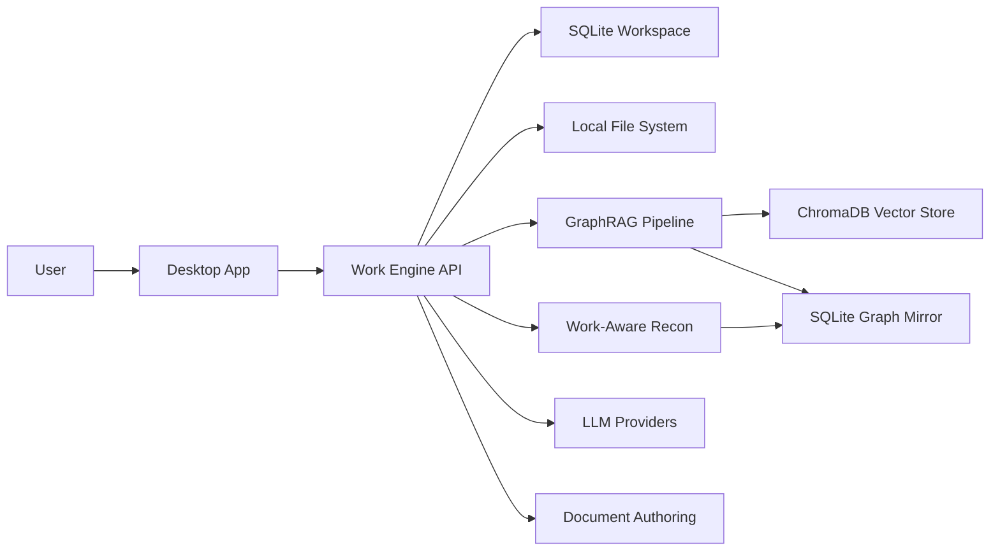

# 로컬 AI에이전트 워크플레이스 : 공무원

> 공공분야 사무업무자를 위한 보안 걱정 없는 로컬 우선 업무공간


로컬 AI에이전트 워크플레이스 : 공무원은 업무대화, 일정, 파일찾기, 지식폴더, 문서작성, 실행기록을 하나의 로컬 작업공간으로 연결하는 Windows 데스크톱 앱입니다. 단순 챗봇이 아니라 사용자의 업무 폴더와 대화 기록을 기반으로 업무 맥락을 쌓고, 필요한 자료를 찾아 문서 산출까지 이어가는 개인 업무 기억 시스템을 목표로 합니다.

내부 코드명과 설치 파일명에는 호환성을 위해 `Gongmu` 표기가 일부 남아 있습니다.

## 개발 목표

최종 목표는 공공분야 사무업무자가 인터넷 연결이나 외부 SaaS 업로드 없이도 자신의 업무 맥락을 축적하고 재사용할 수 있는 `로컬 우선 업무 기억 운영체계`를 만드는 것입니다.

이 프로젝트는 단순 로컬 챗봇이 아니라 아래 흐름을 하나의 작업공간으로 묶는 것을 목표로 합니다.

```text
지식폴더 -> 업무대화 세션 <- 파일찾기
업무대화 세션 -> 일정 / 문서작성 / 도구 실행 / 실행기록
문서작성 -> Content Base -> 보고서 계획 -> HWPX 산출
```

핵심 개발 방향은 다음과 같습니다.

- 업무대화 중심: 모든 작업은 대화 세션을 중심으로 일정, 파일, 지식, 문서작성과 연결됩니다.
- 지식폴더 2.0: 로컬 업무폴더를 스캔해 조직, 부서, 규정, 문서군, 문서 역할을 이해하는 Work-Aware GraphRAG로 발전시킵니다.
- 자체 파일찾기: 외부 검색 프로그램 의존 없이 로컬 파일명/경로 인덱스를 갱신하고 업무대화 세션에 필요한 파일을 연결합니다.
- 공공문서 산출: 대화내용, 연결 파일, 지식폴더 근거를 Content Base와 DocumentPlan으로 정리한 뒤 시행문, 1페이지 보고서, 풀버전 보고서, 이메일 등 HWPX 산출로 이어갑니다.
- 폐쇄망 배포: Windows 앱, 업무엔진, Ollama, Gemma 멀티모달 모델을 설치/검증 가능한 패키지와 안내형 설치 모니터로 제공합니다.

자세한 개발 목표는 [개발 목표 및 제품 비전](docs/operations/2026-07-03-development-goals.md)에 정리합니다.

## 핵심 가치

- 로컬 우선: 업무 데이터는 기본적으로 사용자 PC의 로컬 작업공간에 저장됩니다.
- 폐쇄망 대응: Windows 설치패키지와 Python 업무엔진을 함께 묶어 외부 인터넷이 없는 환경을 고려합니다.
- 업무대화 중심: 일정, 파일, 지식폴더, 문서작성이 업무대화 세션을 중심으로 연결됩니다.
- 근거 기반: GraphRAG 검색 결과는 출처 문서, chunk, 품질 경고, 관계 정보를 함께 보여줍니다.
- 공공문서 지향: HWP/HWPX, 보고서, 시행문, 1페이지 보고서 같은 공공기관 문서 흐름을 우선 고려합니다.

## 주요 기능

| 영역 | 할 수 있는 일 |
| --- | --- |
| 업무대화 | 로컬/내부/외부 LLM 프로필 연결, 파일 첨부, 이미지 첨부, 세션별 기록 저장, 지식폴더 기반 답변 |
| 일정 | 월/주/일 캘린더, 셀 클릭 등록, 일정-대화 세션 연결, 가까운 일정 확인 |
| 파일찾기 | Anything 없이 자체 로컬 파일명/경로 인덱스를 갱신하고 검색, 결과 파일을 업무대화 세션에 연결 |
| 내 지식폴더 | 업무 프로필, 폴더 분석, 문서 역할/문서군 분류, Work-Aware GraphRAG 인덱싱, 업무지식 그래프 탐색 |
| 문서작성 | 업무대화/연결파일/직접 입력을 바탕으로 Content Base와 보고서 계획을 만들고 HWPX 산출 흐름으로 연결 |
| 실행기록/승인 | 민감한 작업의 승인 흐름, 최근 실행 이력, 작업 상태 확인 |

## 빠른 시작

### 사용자 설치

1. Windows x64 PC에서 최신 폐쇄망 패키지 zip을 받습니다.
2. zip을 풀고 `Gongmu_0.1.0_x64-setup.exe`를 실행합니다.
3. 앱 실행 후 우측 상단 업무엔진 신호등이 정상인지 확인합니다.
4. 로컬 LLM을 쓰려면 Ollama 또는 OpenAI-compatible endpoint를 환경설정에 등록합니다.

### 폐쇄망 AI 풀팩 설치

Ollama와 `gemma4:e2b` 멀티모달 모델까지 함께 준비해야 하는 PC에는 AI 풀팩 zip을 사용합니다.

1. AI 풀팩 zip을 대상 PC에 복사하고 압축을 풉니다.
2. 일반 사용자는 `START_INSTALL_GUI.bat`을 실행합니다.
3. 설치 모니터가 현재 단계, 사용자가 닫아야 하는 설치창/앱창, 로그 위치를 안내합니다.
4. 설치 증거를 한 번에 남겨야 하는 검증자는 `RUN_FULL_VALIDATION.bat`을 실행합니다.
5. GUI 실행이 어려운 환경에서는 `START_INSTALL.bat`, `VALIDATE_INSTALL.bat`, `COLLECT_EVIDENCE.bat`을 순서대로 실행합니다.

자세한 절차는 [클린계정/폐쇄망 AI Pack 설치 검증 런북](docs/operations/2026-06-16-clean-account-ai-pack-validation-runbook.md)을 참고합니다.

### 개발 실행

```powershell
npm.cmd install
npm.cmd run sidecar:serve
npm.cmd run desktop:dev
```

### 검증

```powershell
npm.cmd run verify:all
npm.cmd run desktop:bundle
npm.cmd run desktop:smoke:nsis
npm.cmd run release:offline
```

## 아키텍처



| 구성요소 | 역할 |
| --- | --- |
| Desktop App | Tauri + React 기반 Windows 데스크톱 UI |
| Work Engine API | Python FastAPI 기반 로컬 업무엔진 |
| SQLite Workspace | 세션, 일정, 설정, 실행기록, 그래프 mirror 저장 |
| Local File System | 지식폴더, 첨부파일, 문서 산출물, 로컬 파일찾기 대상 |
| GraphRAG Pipeline | parser, chunking, embedding, ontology, retrieval 처리 |
| Work-Aware Recon | 업무 프로필, 기관/부서/규정 후보, 문서 역할, 문서군, 업무 중심 ranking boost 처리 |
| ChromaDB Vector Store | 선택형 vector backend |
| LLM Providers | Ollama, 내부 서버, OpenAI-compatible, OpenRouter, Claude, Gemini, NVIDIA NIM |
| Document Authoring | Content Base에서 HWPX/보고서 산출 흐름으로 연결 |

## 저장소 구조

```text
apps/desktop/              Tauri + React 데스크톱 앱
services/sidecar/          Python FastAPI 업무엔진
scripts/                   검증, 번들, 릴리스 자동화
docs/operations/           검증 결과와 운영 문서
docs/superpowers/plans/    기능별 실행계획
docs/superpowers/specs/    설계 스펙과 연구 노트
release/alpha/             알파 릴리스 문서 스테이징
```

## 문서

- [개발 목표 및 제품 비전](docs/operations/2026-07-03-development-goals.md)
- [사용자 매뉴얼](docs/user-manual/gongmu-user-manual.html)
- [기술 부속문서](docs/TECHNICAL.md)
- [현재 구현 스펙](docs/operations/2026-05-06-current-implementation-spec.md)
- [클린계정/폐쇄망 AI Pack 설치 검증 런북](docs/operations/2026-06-16-clean-account-ai-pack-validation-runbook.md)
- [최신 UI/기능 검증 보고서](docs/operations/2026-05-20-second-feedback-ui-validation-report.md)
- [GraphRAG 품질 게이트 계획](docs/superpowers/plans/2026-05-06-graphrag-ingestion-quality-gate-plan.md)

## 현재 상태

로컬 AI에이전트 워크플레이스 : 공무원은 MVP 이후 기능 고도화 단계입니다. 업무대화 중심 레이아웃, 자체 파일찾기, Work-Aware GraphRAG 2.0의 업무 프로필/문서 역할 분석, 문서작성 HWPX 흐름, Windows NSIS 패키징, Ollama + Gemma AI 풀팩 안내형 설치 모니터가 구현되어 있습니다. 실제 기관 양식 HWPX 렌더링 품질, 대규모 지식폴더 파서 품질, 폐쇄망 PC별 LLM endpoint 구성은 계속 검증해야 하는 운영 항목입니다.

## 라이선스

아직 공개 라이선스가 지정되지 않았습니다. 외부 배포 전 라이선스와 제3자 의존성 고지를 별도로 확정해야 합니다.
