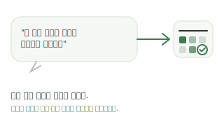
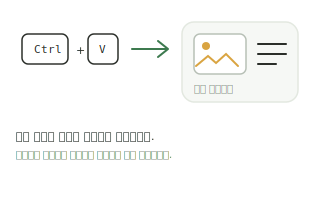
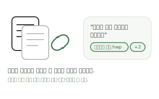
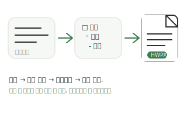
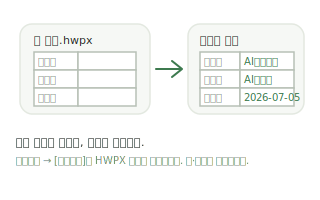
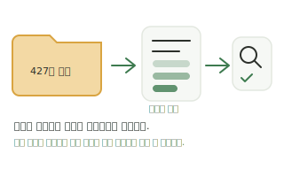

# 앱 기능 안내·이용팁 (2026-07-05)

로컬 AI에이전트 워크플레이스 : 공무원의 6개 메뉴별 핵심 기능과 실전 이용팁을 정리한 문서입니다.

- 여기 적힌 기능은 모두 현재 코드에서 실제 동작이 확인된 것만 기술했습니다.
- 이 문서의 "한 줄 실전 팁"은 `apps/desktop/src/shared/tips.ts`(`APP_TIPS`)와 **단일 원천**으로 관리합니다.
  홈 화면 "앱 이용팁" 카드, 업무대화 입력 대기 안내, 온보딩, 설치 프로그램이 모두 같은 배열을 사용합니다.
  팁을 고치려면 `tips.ts`와 이 문서를 함께 고치세요.
- 팁 회전은 날짜 기반 결정적 인덱스(`dailyTipIndex`)만 사용합니다. `Math.random`은 쓰지 않습니다.

---

## 1. 홈 (오늘의 브리핑)

앱을 켜면 처음 보이는 화면입니다. 오늘 할 일과 이어갈 업무를 카드로 모아 보여줍니다.

핵심 기능
- **오늘 일정 카드**: 24시간 안에 시작하는 일정을 시간순으로 최대 3건 표시. 일정에 세션이 연결돼 있으면 [세션 열기]로 업무대화에 바로 진입합니다.
- **이어서 하기 카드**: 가장 최근 업무대화 세션과 마지막 메시지 미리보기. 승인 대기 건수가 있으면 함께 알려줍니다.
- **지식 브리핑 카드**: 지식위키의 문서·주제·업무 기록 수와 최근 색인 상태.
- **오늘의 제안 카드**: 다가오는 일정 제목으로 지식폴더를 검색해 관련 문서가 있으면 보고 초안 작성을 제안합니다(LLM 없이 결정적 검색).
- **앱 이용팁 카드**: 오늘의 팁 1개 + [다음 팁] + 해당 기능 화면으로 이동 버튼.
- **첫 실행 온보딩**: 일정·세션 데이터가 하나도 없으면 카드 대신 3단계 시작 가이드(LLM 연결 → 지식폴더 등록·색인 → 첫 세션 시작)가 나옵니다.

## 2. 업무대화

업무 요청을 자연어로 남기는 중심 화면입니다. 단순 채팅이 아니라 일정·문서·지식 기능으로 요청을 라우팅합니다.

핵심 기능
- **자연어 일정 등록**: 날짜·시간이 포함된 요청("내일 오전 10시 주간회의 일정 등록해줘", "7월 10일 14시 부서 보고 잡아줘")은 일정으로 바로 등록됩니다. `오늘`, `내일`, `7월 10일`, `2026-07-10` 형태의 날짜와 `오전/오후 N시`, `14:00` 형태의 시간을 인식합니다.
- **일정 조회·삭제**: "이번 주 일정 알려줘"처럼 물으면 등록된 일정을 정리해 답하고, "○○ 일정 삭제해줘"로 삭제할 수 있습니다.
- **문서작성 요청**: "보고서 초안 작성해줘"처럼 문서 키워드가 들어간 요청은 문서작성 작업으로 이어져 HWPX 산출물을 만듭니다. 세션에 연결된 파일이 근거 자료로 함께 쓰입니다.
- **근거 답변**: 지식폴더가 색인돼 있으면 답변에 출처 칩이 붙습니다. 칩에서 원본 열기·경로 복사가 가능합니다.
- **첨부**: 파일 첨부 버튼, 입력창에 드래그&드롭, 그리고 캡처 이미지 Ctrl+V 붙여넣기(자동으로 "클립보드-날짜시간.png" 이름이 붙음)를 지원합니다.
- **파일 연결 모달**: 툴바 [파일 연결]에서 연결된 파일 확인·해제, 파일명 색인 검색, 인덱스 갱신을 한곳에서 처리합니다. 행 제목은 파서가 남긴 깨진 제목 대신 읽기 좋은 파일명으로 보정됩니다.
- **문서작성으로 이어가기 / 이 세션 지식 반영**: 툴바 버튼으로 현재 세션 대화를 문서 입력으로 넘기거나, 지식위키에 바로 축적합니다.
- **세부 설정**: 이번 응답에만 쓸 모델 오버라이드와 리즈닝 강도(자동~높음)를 지정할 수 있습니다.
- **입력 대기 안내**: 입력창이 비어 있으면 composer 위에 "이렇게 말해보세요" 예시가 표시되고, 클릭하면 입력창에 예시 문구만 채워집니다(전송되지 않음).

실전 팁
- 실패한 응답은 [다시 시도] 버튼으로 같은 내용을 재전송할 수 있고, 입력했던 본문은 사라지지 않고 입력창에 복원됩니다.
- Enter는 전송, Shift+Enter는 줄바꿈입니다.

## 3. 일정

주간 시간표 형태의 캘린더로 일정을 관리하고 업무 흐름과 연결합니다.

핵심 기능
- **사전 알림**: 일정마다 없음/10분 전/30분 전/1시간 전/하루 전 알림을 설정할 수 있습니다. 시간이 되면 홈에서 "곧 시작" 토스트, 일정 화면에서 알림 배너가 뜨고 [확인]으로 처리합니다.
- **세션 연결**: 일정에 업무대화 세션을 연결하면 홈 브리핑과 우측 패널이 해당 업무 중심으로 정리됩니다.
- **대화로 돌아가기**: 업무대화에서 일정 화면으로 넘어온 경우 상단 복귀 칩으로 원래 세션에 바로 돌아갑니다.

## 4. 문서작성

업무대화 세션·파일·직접 작성 내용을 바탕으로 작성 콘텐츠를 만들고 HWPX 산출물까지 생성합니다.

핵심 기능
- **탭 흐름**: 참고자료 → 작성 콘텐츠(편집·수정지시) → 미리보기 → 최종(산출물·승인·다운로드).
- **양식 4종 + 임의형식**: 1페이지 보고서 등 서버 제공 양식 외에, **임의형식** 칩에서 갖고 있는 HWPX/HWTX 양식을 업로드할 수 있습니다. [양식 분석]이 빈 서식 필드를 감지하면 값을 제안받아 [양식에 채우기], 서식 필드가 없으면 본문 교체형으로 [양식에 반영]합니다. 표·로고·서식은 그대로 보존됩니다.
- **수정지시**: 작성 콘텐츠에 자연어 지시("2번 항목을 더 짧게" 등)를 반복 입력해 구조를 수정합니다. 지시 반영에 실패해도 기존 구조는 바뀌지 않습니다.
- **세션 기반 작성**: 업무대화의 [문서작성으로 이어가기]나 홈 "오늘의 제안"에서 넘어오면 세션 대화가 입력으로 프리필됩니다.

## 5. 내 지식폴더

내 문서 폴더를 등록·색인해 지식위키를 만들고, 검색과 근거 답변의 원천으로 씁니다.

핵심 기능
- **지식폴더 등록·색인**: 폴더를 등록하고 색인하면 파일이 위키 문서 카드로 정리됩니다. 색인 진행 상태(대기/진행 중/부분 완료/완료/실패)는 홈 지식 브리핑에서도 보입니다.
- **분류체계 마법사(Work-Aware)**: 3단계(니즈 파악 → 편집형 트리 검토 → 적용)로 지식폴더를 분석해 업무 분류 트리를 제안합니다. 후보 업무를 제외·수정한 뒤 확정하면 기준이 SCHEMA.md에 기록되고, 적용 진행은 작업 패널에서 확인합니다.
- **근거 답변**: 위키 탭에서 키워드 검색 또는 근거 답변을 실행합니다. 근거 답변은 검색 근거 개수와 출처를 함께 보여주고, 복사하거나 업무대화 입력창으로 넘겨 이어서 검토할 수 있습니다.
- **요약 재작성**: 위키 문서 카드의 요약을 LLM으로 다시 작성해 검색·근거 답변 품질을 높일 수 있습니다.

## 6. 실행기록

앱이 수행한 작업 이력을 시간순으로 보여주는 감사 화면입니다.

핵심 기능
- 기능·동작·상태·입출력이 기록되어 언제 무엇이 실행됐는지 추적할 수 있습니다.
- 승인이 필요한 작업(문서 확정 등)은 승인 대기로 남고, 우측 패널의 승인 섹션에서 처리합니다.

## 7. 환경설정

로컬 우선 설정을 관리합니다.

핵심 기능
- **LLM 연결**: 모델 제공자·모델·API 키를 설정합니다. 연결 전에는 업무대화 입력 위에 설정 안내가 표시됩니다.
- **프로필**: LLM 설정을 프로필로 여러 개 저장해 두고 전환할 수 있습니다.
- **경로**: 작업공간·지식·문서 저장 경로를 확인합니다.

---

## 한 줄 실전 팁 (tips.ts 단일 원천, 16개)

| # | id | 분류 | 팁 | 이동 메뉴 |
|---|----|------|----|-----------|
| 1 | `chat-clipboard-image` | 업무대화 | 화면을 캡처한 뒤 업무대화 입력창에 Ctrl+V를 누르면 이미지가 바로 첨부됩니다. | 업무대화 |
| 2 | `chat-schedule-create` | 업무대화 | 날짜·시간을 넣어 말하면 업무대화가 일정을 바로 등록합니다. (예시: "내일 오전 10시 주간회의 일정 등록해줘") | 업무대화 |
| 3 | `chat-file-link-doc` | 업무대화 | [파일 연결]로 자료를 세션에 묶은 뒤 보고서를 요청하면 연결한 파일이 근거로 쓰입니다. (예시: "연결한 파일을 바탕으로 보고서 초안 작성해줘") | 업무대화 |
| 4 | `chat-knowledge-evidence` | 업무대화 | 지식폴더를 색인해 두면 업무대화 답변에 출처 칩(원본 열기·경로 복사)이 함께 붙습니다. (예시: "지식폴더에서 예산 편성 근거 찾아줘") | 업무대화 |
| 5 | `chat-schedule-list` | 업무대화 | 등록된 일정이 궁금하면 업무대화에서 바로 물어볼 수 있습니다. (예시: "이번 주 일정 알려줘") | 업무대화 |
| 6 | `chat-enter-send` | 업무대화 | Enter는 전송, Shift+Enter는 줄바꿈입니다. 파일은 입력창에 드래그해 놓아도 첨부됩니다. | 업무대화 |
| 7 | `chat-session-knowledge` | 업무대화 | 업무대화 툴바의 [이 세션 지식 반영]을 누르면 대화 내용이 지식위키에 바로 축적됩니다. | 업무대화 |
| 8 | `chat-continue-to-documents` | 업무대화 | 업무대화 툴바의 [문서작성으로 이어가기]로 현재 세션 대화를 문서 입력으로 넘길 수 있습니다. | 업무대화 |
| 9 | `schedule-reminder` | 일정 | 일정에 사전 알림(10분~하루 전)을 걸어 두면 시작 전에 홈과 일정 화면에서 알려줍니다. | 일정 |
| 10 | `schedule-session-link` | 일정 | 일정에 업무대화 세션을 연결하면 홈 '오늘 일정' 카드에서 [세션 열기]로 바로 이어집니다. | 일정 |
| 11 | `documents-custom-form` | 문서작성 | 문서작성의 임의형식 칩에 HWPX/HWTX 양식을 올리면 표·로고·서식을 보존한 채 빈칸을 채웁니다. | 문서작성 |
| 12 | `documents-revise` | 문서작성 | 문서 초안이 마음에 안 들면 수정 지시에 자연어로 적어 반복 수정할 수 있습니다. 실패해도 기존 구조는 유지됩니다. | 문서작성 |
| 13 | `knowledge-taxonomy-wizard` | 내 지식폴더 | 분류체계 마법사가 지식폴더를 분석해 업무 분류 트리를 제안합니다. 검토·편집한 뒤 적용하세요. | 내 지식폴더 |
| 14 | `knowledge-grounded-answer` | 내 지식폴더 | 내 지식폴더 위키 탭의 근거 답변은 출처와 함께 답하고, 결과를 업무대화로 이어서 검토할 수 있습니다. | 내 지식폴더 |
| 15 | `logs-history` | 실행기록 | 실행기록에서 언제 무엇이 실행됐는지 입력·출력과 함께 확인할 수 있습니다. | 실행기록 |
| 16 | `settings-profiles` | 환경설정 | 환경설정에서 LLM 프로필을 여러 개 저장해 두고 상황에 맞게 전환할 수 있습니다. | 환경설정 |

예시 문구(`chatExample`)가 있는 2·3·4·5번 팁은 업무대화 입력 대기 안내("이렇게 말해보세요")에서 회전합니다.
