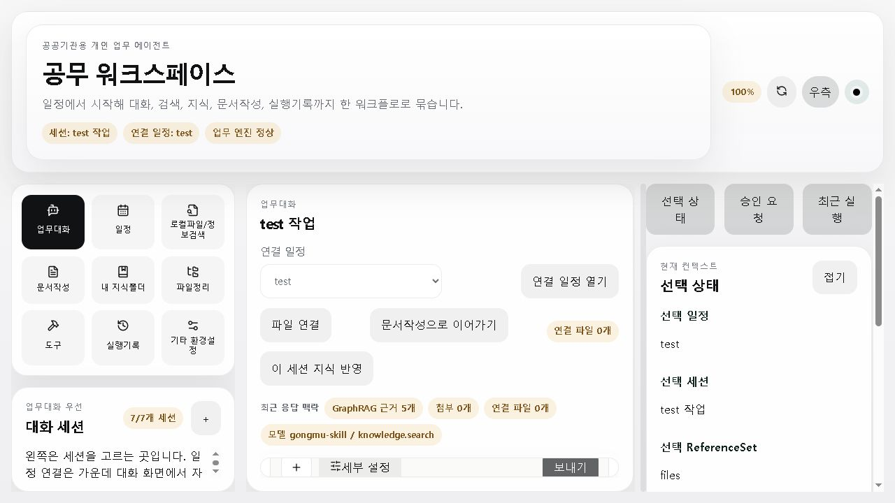
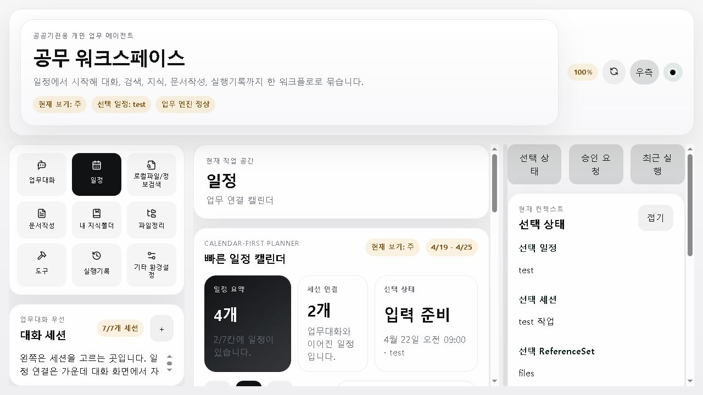
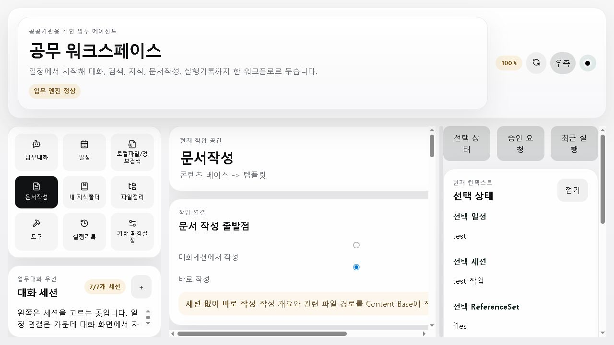

# 2026-05-18 주요 기능 강화 및 컴퓨터유즈 검증 결과보고

## 1. 목적

이번 점검은 Gongmu의 핵심 흐름을 "업무대화 중심 실행 환경"으로 끌어올리는 것이 목적이다.

강화 대상은 아래 3개 축이다.

- 업무대화 중 GraphRAG 검색, 일정 등록/조회/삭제, HWPX 문서작성 실행
- 일정 화면의 가독성, 일정 밀도 확인, 편집/삭제 흐름 개선
- `Kminer2053/public-doc-to-hwpx`의 공공문서 작성 원칙을 반영한 4종 HWPX 산출 UX 개선

## 2. 구현 요약

### 업무대화 스킬 실행

- GraphRAG 요청 감지 시 일반 LLM 응답 전에 내부 GraphRAG DB를 먼저 검색한다.
- 답변에는 근거 요약, 출처 문서, 파일 열기 버튼, 폴더 열기 버튼이 표시된다.
- 일정 등록/조회/삭제 요청은 업무대화에서 직접 처리하며 일정 DB에 반영된다.
- 문서작성 요청은 Content Base 생성, 승인, 최종 HWPX 적용까지 자동 실행한다.
- 컴퓨터유즈 자동 입력 검증을 위해 영문 명령 표현도 보조 지원한다.

### 일정 기능 UI

- 월/주/일 캘린더 위에 일정 요약, 세션 연결 수, 선택 상태를 먼저 표시한다.
- 일정이 있는 칸은 배경색과 좌측 accent bar로 명확히 구분한다.
- 가까운 일정 패널을 추가해 현재 등록된 일정을 빠르게 훑을 수 있게 했다.
- 기존 일정 클릭 시 편집, 연결 세션 열기/만들기, 일정 삭제가 가능하다.
- 삭제 API는 연결된 업무대화 세션의 `schedule_id`를 안전하게 해제한다.

### 문서작성 기능

- 출력 유형은 시행문, 1페이지 보고서, 풀버전 보고서, 이메일 4종을 중심으로 안내한다.
- 문서작성 화면에 `public-doc-to-hwpx 작성 원칙` 안내 카드와 4종 양식 카드를 추가했다.
- 산출 HWPX/검토용 Markdown에 작성 품질 점검 섹션을 포함한다.
- 두괄식, 개조식, 한 문장 한 핵심, 적/의/것/들 정리 원칙을 산출 단계에 반영한다.
- 사용자 HWPX/HWTX 양식 업로드 후 생성 내용을 이어 붙이는 흐름을 유지한다.

## 3. 컴퓨터유즈 기반 실제 조작 결과

검증 환경은 Windows Codex 세션, sidecar `127.0.0.1:8765`, Vite dev `127.0.0.1:5173`이다.

### 화면 기동

- `http://127.0.0.1:5173/`에서 앱이 열렸다.
- 상단 업무 엔진 상태가 정상으로 표시됐다.
- 업무대화, 일정, 문서작성 화면 전환이 가능했다.

### 업무대화 스킬

- 직접 키 입력으로 `2026-05-21 16 ui smoke schedule add`를 보냈다.
- 응답은 `gongmu-skill / schedule.create`로 표시됐다.
- 답변에 "일정을 등록했습니다"와 시간 정보가 표시됐다.
- 일정 화면으로 이동했을 때 `ui smoke` 일정이 캘린더에 반영됐다.
- 직접 키 입력으로 `create 1p hwpx report document`를 보냈다.
- 응답은 `gongmu-skill / document.create`로 표시됐고 HWPX 파일 경로와 폴더 경로가 표시됐다.
- 직접 키 입력으로 `knowledge rag search ai strategy source`를 보냈다.
- 응답은 `gongmu-skill / knowledge.search`로 표시됐고 GraphRAG 근거, 출처, 파일/폴더 열기 버튼이 표시됐다.

### 일정 UI

- 일정 화면에서 "일정 요약", "세션 연결", "선택 상태" 카드가 보였다.
- "가까운 일정" 패널이 보였고 등록 일정 목록이 표시됐다.
- 일정이 있는 주간 셀을 클릭하면 "기존 일정 편집", "연결 세션 열기", "일정 삭제"가 표시됐다.

### 문서작성 UI

- 문서작성 화면에서 `public-doc-to-hwpx 작성 원칙` 카드가 표시됐다.
- 시행문, 1페이지 보고서, 풀버전 보고서, 이메일 카드가 표시됐다.
- 사용자 HWPX/HWTX 양식 업로드/선택 영역이 유지됐다.

## 4. 검증 스크린샷







## 5. 자동 검증 결과

통과한 명령은 다음과 같다.

```powershell
npm.cmd run sidecar:test -- services/sidecar/tests/test_work_session_turn.py services/sidecar/tests/test_api_flows.py services/sidecar/tests/test_document_workflow.py -q
npm.cmd --workspace apps/desktop run test -- src/schedule-editor-linked-session.test.tsx src/document-workflow-handoff.test.tsx
npm.cmd --workspace apps/desktop run build
node scripts/portable-run.mjs cargo check --manifest-path apps/desktop/src-tauri/Cargo.toml
```

## 6. 사용경험 평가

좋아진 점은 업무대화가 단순 채팅이 아니라 실제 작업 실행 진입점처럼 동작하기 시작했다는 점이다. GraphRAG 답변은 출처와 파일/폴더 열기 버튼을 함께 제공해 근거 확인 흐름이 명확해졌다. 일정 화면은 등록 현황, 연결 여부, 가까운 일정을 한 화면에서 볼 수 있어 이전보다 일정관리 앱에 가까워졌다. 문서작성은 4종 양식과 작성 원칙이 화면에 직접 드러나 사용자가 무엇을 선택하는지 이해하기 쉬워졌다.

남은 UX 리스크도 있다. GraphRAG 검색 결과에서 같은 문서가 중복 출처로 반복될 수 있어 dedupe/reranking 보강이 필요하다. Codex in-app Browser 자동화에서는 virtual clipboard가 설치되어 있지 않아 한글 자동 입력은 직접 수행하지 못했고, 영문 키 입력으로 스킬 경로를 검증했다. 이는 실제 사용자 입력 문제가 아니라 컴퓨터유즈 자동화 표면의 제약이다.

## 7. 참고한 외부 기준

- [Kminer2053/public-doc-to-hwpx](https://github.com/Kminer2053/public-doc-to-hwpx): 공공문서 HWPX 생성 흐름과 4종 문서작성 방향 참고
- [Google Calendar 도움말](https://support.google.com/calendar/answer/72143): 캘린더에서 일정 생성 흐름 참고
- [Microsoft Outlook Calendar 도움말](https://support.microsoft.com/office/introduction-to-the-outlook-calendar-d94c5203-77c7-48ec-90a5-2e2bc10bd6f8): 일/주/월 중심 캘린더 보기 흐름 참고

## 8. 결론

이번 목표의 주요 기능 강화는 구현 및 검증 완료 상태다.

다음 단계는 GraphRAG 출처 중복 제거, 한국어 자연어 일정 파서 고도화, 문서작성 산출물의 서식 품질 개선이다. 이 셋은 기능 블로커라기보다는 품질을 더 끌어올리는 후속 개선 항목으로 보는 것이 적절하다.
