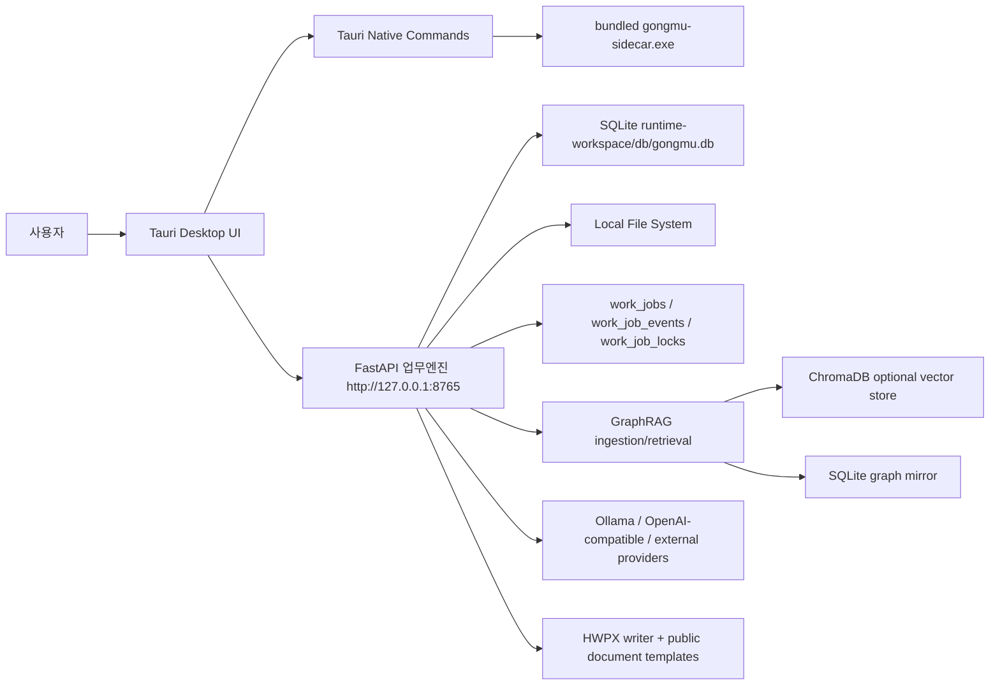

# 코드 현황 파악 및 외부 검수용 기술 문서

작성일: 2026-05-23
대상 저장소: `C:\Users\USER\Agent_Gongmu\Agent_Gongmu_Codex`
제품명: 로컬 AI에이전트 워크플레이스 : 공무원
내부 코드명: Gongmu
검수 목적: 제3자가 코드 구조, 기능별 내부 동작, 검증 범위, 미진한 부분을 빠르게 파악하고 리뷰할 수 있도록 구체적인 기준점을 제공한다.

---

## 1. 제품 컨셉

이 프로젝트는 공공분야 사무업무자를 위한 Windows 로컬 우선 업무 워크스페이스다. 핵심 단위는 `업무대화 세션`이며, 일정, 파일찾기, 지식폴더, 문서작성, 실행기록, 승인 흐름이 세션을 중심으로 연결된다.

```text
지식폴더 -> 업무대화 세션 <- 파일찾기
업무대화 세션 -> 일정 / 문서작성 / 도구 실행 / 실행기록
문서작성 -> HWPX 산출물
작업 진행 -> work_jobs 기반 상태/로그/취소 추적
```

중요한 설계 원칙은 다음과 같다.

- 로컬 우선: 업무 데이터와 지식 인덱스는 기본적으로 `runtime-workspace` 아래에 저장한다.
- 폐쇄망 대응: Windows 설치패키지에 Python 업무엔진과 주요 런타임을 포함한다.
- 업무대화 중심: 사용자는 대화에서 일정 등록, 지식 검색, 문서작성 같은 도구 실행을 자연어로 요청할 수 있어야 한다.
- 근거 기반: GraphRAG 답변은 출처 문서, chunk, 품질 경고, 관계 정보를 함께 제공해야 한다.
- 공공문서 지향: HWPX, 시행문, 1페이지 보고서, 풀버전 보고서, 이메일 양식을 우선 지원한다.

---

## 2. 저장소 구조

| 경로 | 역할 | 검수 포인트 |
| --- | --- | --- |
| `apps/desktop` | Tauri + React + TypeScript 데스크톱 UI | 사용자 흐름, 3패널 레이아웃, API client, Vitest |
| `apps/desktop/src/app.tsx` | 대부분의 UI와 화면별 상태/액션 로직 | 파일이 매우 크므로 기능별 분리 여지가 큼 |
| `apps/desktop/src/api.ts` | 업무엔진 API 타입과 호출 함수 | API 응답 타입과 Python 응답 스키마 일치 여부 |
| `apps/desktop/src/runtime.ts` | Tauri command bridge 및 browser fallback | dev/release 런타임 차이 처리 |
| `apps/desktop/src-tauri/src/main.rs` | 업무엔진 자동 시작/복구, 메뉴, 줌, 파일 열기 | 설치 후 자동 시작, crash 복구, resource path |
| `services/sidecar` | Python FastAPI 업무엔진 | API, DB, GraphRAG, LLM, 문서작성 |
| `services/sidecar/src/gongmu_sidecar/app.py` | FastAPI endpoint와 업무대화 도구 라우팅 | 파일이 매우 크고 기능 결합도가 높음 |
| `services/sidecar/src/gongmu_sidecar/db.py` | SQLite schema와 repository | schema migration 전략 부재, 동시성 보호 |
| `services/sidecar/src/gongmu_sidecar/jobs.py` | 범용 작업 상태/락/이벤트 관리 | queued/blocked/running 전환과 복구 정책 |
| `services/sidecar/src/gongmu_sidecar/graphrag_ingestion.py` | 지식폴더 스캔/파싱/chunk/embedding/graph | 대용량 문서 품질과 실패 추적 |
| `services/sidecar/src/gongmu_sidecar/document_parsers.py` | 문서 포맷별 파서 | HWP/PDF fallback 품질 |
| `services/sidecar/src/gongmu_sidecar/documents.py` | Content Base와 HWPX 산출 흐름 | public-doc-to-hwpx 취지 반영 수준 |
| `services/sidecar/src/gongmu_sidecar/hwpx_writer.py` | HWPX 패키지 생성/템플릿 반영 | 템플릿 충실도와 한컴 호환성 |
| `services/sidecar/src/gongmu_sidecar/llm.py` | Ollama/OpenAI-compatible/OpenRouter/Claude/Gemini/NIM 호출 | provider별 응답 파싱, 멀티모달 전달 |
| `scripts` | Windows 빌드, smoke, release 자동화 | NSIS smoke와 offline zip 산출물 |
| `docs` | 설계, 검증, 운영 문서 | 최신 기능과 문서 동기화 여부 |

---

## 3. 런타임 구조



개발 모드는 `npm.cmd run sidecar:serve`와 `npm.cmd run desktop:dev`를 사용한다. 릴리스 모드는 `npm.cmd run desktop:bundle`이 PyInstaller sidecar를 만들고 Tauri NSIS 설치파일에 포함한다.

---

## 4. 주요 API 표면

`services/sidecar/src/gongmu_sidecar/app.py` 기준 주요 endpoint는 다음과 같다.

| 영역 | Endpoint | 역할 |
| --- | --- | --- |
| Health | `GET /health` | 업무엔진 상태와 workspace/database 경로 확인 |
| 작업 큐 | `GET /api/jobs`, `GET /api/jobs/{id}`, `GET /api/jobs/{id}/events`, `POST /api/jobs/{id}/cancel` | 범용 작업 조회/이벤트/취소 |
| 설정 | `GET/PUT /api/settings`, `POST /api/settings/llm-test` | LLM/GraphRAG/개인화 설정 |
| 일정 | `POST/GET/PATCH/DELETE /api/schedules` | 일정 생성/조회/수정/삭제 |
| 업무대화 | `POST/GET/PATCH /api/work-sessions`, `/messages`, `/attachments`, `/turn`, `/turn/stream` | 세션, 메시지, 첨부, LLM/스킬 턴 |
| 파일 연결 | `GET/POST/DELETE /api/work-sessions/{id}/file-links` | 세션-파일 경로 연결 |
| 파일찾기 | `GET /api/files/search`, `POST /api/files/index/rebuild` | 자체 파일명 검색과 인덱스 갱신 |
| 지식폴더 | `POST /api/knowledge/sources`, `/scan`, `/ingest`, `/reindex` | 지식 소스 등록/스캔/GraphRAG 인덱싱 |
| GraphRAG | `/api/knowledge/retrieve`, `/ask`, `/graph`, `/graph/query`, `/document-structure`, `/tables` | 검색, 답변, 그래프, 구조/표 조회 |
| 문서작성 | `/api/documents/content-bases`, `/generate`, `/finalize`, `/templates/custom`, `/attachments` | Content Base, HWPX 산출, 양식/첨부 |
| Anything 연계 | `/api/integrations/anything/*` | 외부 Anything 실행/기록/Reference Set import |
| 승인 | `/api/approval-tickets`, `/decision` | 민감 작업 승인 |
| 파일정리 | `/api/file-organizer/proposals`, `/apply`, `/apply/commit`, `/rollback` | 정리 제안, 승인, 적용, 롤백 |
| 실행기록 | `GET /api/execution-logs` | 최근 실행 이력 |

---

## 5. 데이터 모델과 저장 방식

SQLite schema는 `db.py`의 `SCHEMA` 문자열에 정의되어 있다. 주요 테이블은 다음과 같다.

| 테이블 | 역할 |
| --- | --- |
| `schedules` | 일정 |
| `work_sessions` | 업무대화 세션 |
| `work_session_messages` | 세션별 user/assistant 메시지 |
| `work_session_attachments` | 채팅 첨부파일 |
| `work_session_file_links` | 세션과 로컬 파일 경로 연결 |
| `reference_sets`, `reference_items` | 파일/자료 묶음 |
| `approval_tickets` | 외부 실행/파일 변경/최종 저장 승인 |
| `execution_logs` | 실행 이력 |
| `work_jobs` | 범용 장기/보호 작업 상태 |
| `work_job_events` | 작업별 이벤트 로그 |
| `work_job_locks` | 자원별 exclusive lock |
| `knowledge_sources`, `knowledge_source_files` | 등록 지식폴더와 파일 메타데이터 |
| `knowledge_documents`, `knowledge_chunks`, `knowledge_graph_nodes`, `knowledge_graph_edges` | GraphRAG 문서/chunk/그래프 mirror |
| `file_search_index` | 자체 파일명 검색 인덱스 |
| `document_content_bases`, `document_outputs` | 문서작성 중간/최종 산출물 |

동시성 보강은 다음 방식이다.

- SQLite `WAL`과 `busy_timeout` 적용
- `Database` write lock과 transaction context manager 적용
- 장기/충돌 가능 작업은 `work_jobs`와 resource lock으로 상태를 분리
- 같은 세션의 업무대화 응답은 `work_session:{session_id}` exclusive lock으로 중복 LLM 호출을 방지

한계점:

- 별도 schema migration 도구가 없다. schema 변경은 `CREATE TABLE IF NOT EXISTS`와 코드 보정에 의존한다.
- 대규모 데이터에서 SQLite 단일 파일의 유지보수, 백업, vacuum 정책이 아직 운영 문서 수준이다.
- `work_jobs`는 상태 추적 기반은 갖췄지만 모든 장기 작업이 완전한 background worker pool로 이전된 것은 아니다.

---

## 6. 기능별 내부 동작

### 6.1 업무대화

주요 코드:

- UI: `apps/desktop/src/app.tsx`
- API client: `apps/desktop/src/api.ts`
- Backend routing: `services/sidecar/src/gongmu_sidecar/app.py`
- LLM provider: `services/sidecar/src/gongmu_sidecar/llm.py`

동작 순서:

1. 사용자가 채팅 입력창에서 메시지와 첨부파일을 보낸다.
2. UI는 `/api/work-sessions/{session_id}/turn/stream` 또는 `/turn`을 호출한다.
3. backend는 user message를 저장하고 `work_session.turn` 작업을 만든다.
4. 같은 세션에 이미 진행 중인 응답이 있으면 LLM을 호출하지 않고 작업 진행 패널 안내를 반환한다.
5. `_try_run_work_session_skill()`이 일정/지식검색/문서작성/사용법 안내 intent를 먼저 검사한다.
6. 명확한 복합 요청은 `intent.plan`으로 분해해 여러 도구를 순차 실행한다.
7. 도구에 해당하지 않으면 `_chat_guardrail_prompt()`와 GraphRAG prompt block을 붙여 LLM provider를 호출한다.
8. assistant message, latency, provider, model, 작업 결과가 DB에 저장된다.
9. UI는 Markdown renderer로 답변을 출력하고, 우측 패널에 최근 응답 맥락/작업 로그를 표시한다.

검수 포인트:

- `_try_run_work_session_skill()`의 규칙 기반 intent 분류가 과도하게 넓거나 좁지 않은가.
- 멀티모달 첨부가 provider별 요청 포맷에 정확히 전달되는가.
- 외부 모델이 내부 reasoning을 출력할 때 `_strip_assistant_reasoning_trace()`가 충분한가.
- SSE streaming과 non-streaming 응답의 결과 스키마가 일관적인가.

현재 한계:

- 규칙 기반 intent planner는 명확한 요청에는 강하지만 애매한 복합 요청은 LLM classifier가 필요하다.
- provider별 vision capability 자동 판별은 제한적이다. 모델명만으로 멀티모달 가능 여부를 완전히 보장하지 않는다.
- Browser 자동 입력은 현재 Codex in-app browser의 virtual clipboard 제약으로 직접 타이핑 자동화가 제한된다.

### 6.2 일정

주요 코드:

- UI: `renderScheduleSection()` in `apps/desktop/src/app.tsx`
- Backend: `/api/schedules`
- DB: `schedules`

동작 순서:

1. 월/주/일 planner slot을 계산한다.
2. 사용자가 캘린더 칸을 클릭하면 일정 form의 시작/종료 시간이 갱신된다.
3. 일정 생성/수정/삭제는 sidecar API를 통해 DB에 반영된다.
4. 일정과 세션을 연결하면 `work_sessions.schedule_id`가 갱신된다.
5. 업무대화에서 일정 등록/조회/삭제를 요청하면 routing skill이 schedule API를 실행한다.

현재 한계:

- 반복 일정, 참석자, 알림, 외부 캘린더 동기화는 없다.
- 일정 충돌 탐지와 추천 시간 기능은 없다.
- 일정 UI는 자체 구현이며 Outlook/Google Calendar 수준의 drag-resize는 아직 없다.

### 6.3 파일찾기

주요 코드:

- UI: `renderSearchSection()` in `apps/desktop/src/app.tsx`
- Backend: `local_file_search.py`, `/api/files/search`, `/api/files/index/rebuild`
- DB: `file_search_index`, `work_session_file_links`

동작 순서:

1. 사용자가 검색 root를 선택하거나 기본 root를 사용한다.
2. `rebuildLocalFileIndex()`가 `files.index.rebuild` 작업을 만들고 파일명을 스캔한다.
3. 검색은 파일명 기반 scoring으로 결과를 반환한다.
4. 결과 카드를 클릭하면 우측 미리보기에 세부정보가 표시된다.
5. `세션에 연결`을 누르면 현재 업무대화 세션에 파일 경로가 연결된다.

현재 한계:

- Everything 수준의 NTFS USN journal 기반 즉시 색인은 아니다.
- 파일 내용 검색은 GraphRAG/지식폴더 쪽에 가깝고, 파일찾기는 현재 파일명 검색 중심이다.
- 대용량 전체 드라이브 최초 색인 시간은 PC 성능과 제외 규칙에 크게 좌우된다.

### 6.4 내 지식폴더 / GraphRAG

주요 코드:

- UI: `renderKnowledgeSection()` in `apps/desktop/src/app.tsx`
- Backend: `graphrag_ingestion.py`, `document_parsers.py`, `embeddings.py`, `ontology.py`, `graphrag_backends.py`
- DB: `knowledge_sources`, `knowledge_source_files`, `knowledge_documents`, `knowledge_chunks`, graph tables

처리 파이프라인:

```text
폴더 등록 -> 파일 스캔 -> parse_document -> section-aware chunk
-> embedding -> ChromaDB optional upsert -> ontology extraction
-> SQLite graph mirror -> retrieve/ask/graph query
```

지원 포맷:

- 텍스트: TXT, MD, Markdown
- Office XML: DOCX, XLSX, PPTX
- PDF: pypdf 기반 텍스트 추출
- HWP/HWPX: KORdoc bridge 우선, fallback metadata/zip XML parser

품질 표시:

- 문서별 `structured`/`partial`
- parser name
- quality score
- section/table/chunk count
- warning
- full log dump JSONL

현재 한계:

- PDF 스캔본, 깨진 HWP, 복잡한 표/이미지 중심 문서는 `partial` 또는 `quality 0%`가 나올 수 있다.
- HWP는 KORdoc/pyhwp/LibreOffice/OCR fallback chain이 계획되어 있으나 모든 fallback이 동등하게 완성된 것은 아니다.
- ChromaDB는 기본 포함 방향이지만, 장애 시 SQLite fallback으로 동작할 수 있다. vector 품질은 embedding provider 설정에 의존한다.
- 그래프는 SQLite mirror 중심이며, KuzuDB 같은 별도 graph DB는 현재 기본 탑재하지 않았다.

### 6.5 문서작성 / HWPX

주요 코드:

- UI: `renderDocumentSection()` in `apps/desktop/src/app.tsx`
- Backend: `documents.py`, `hwpx_writer.py`
- Template assets: `services/sidecar/src/gongmu_sidecar/public_doc_templates`

동작 순서:

1. 사용자가 대화세션 또는 바로작성을 선택한다.
2. 세션 연결 파일, 직접 첨부 파일, 파일별 활용계획, 작업설명을 입력한다.
3. 산출 유형을 `시행문`, `1페이지 보고서`, `풀버전 보고서`, `이메일` 중 선택한다.
4. 특정 HWPX/HWTX 양식이 있으면 업로드하거나 경로를 지정한다.
5. `/api/documents/generate`가 자료를 모아 Content Base와 HWPX 산출물을 만든다.
6. 업무대화에서 문서작성을 요청하는 경우 document skill로 라우팅되어 결과 파일/폴더 경로를 답변한다.

현재 한계:

- public-doc-to-hwpx 원 리포의 “고품질 공공문서 작성 노하우”는 핵심 원칙과 기본 템플릿 반영 수준이다. 완전한 문서 품질 평가는 실제 한컴 오피스에서 열어 서식 충실도를 확인해야 한다.
- HWPX 생성은 XML skeleton/template 기반이므로 복잡한 기존 양식의 모든 스타일/필드 보존을 보장하지 않는다.
- 최종 HWPX 내용 품질은 연결파일 파싱 품질, LLM 설정, 사용자의 작업설명 품질에 영향을 받는다.

### 6.6 파일정리

주요 코드:

- UI: `renderFileOrgSection()` in `apps/desktop/src/app.tsx`
- Backend: `file_organizer.py`, `/api/file-organizer/*`

동작 순서:

1. 대상 폴더 경로를 기준으로 정리 제안을 생성한다.
2. 제안별 승인 티켓을 만들고 사용자가 승인한다.
3. `/apply/commit`은 `fileorg.apply` 작업으로 실제 적용한다.
4. 적용 결과는 operation으로 남고 rollback 가능하다.
5. rollback도 `fileorg.rollback` 작업으로 기록된다.

현재 한계:

- 정리 제안 로직은 아직 보수적이며, 자동 분류/자동 이동 품질을 고도화해야 한다.
- 대규모 폴더 이동 중 일부 실패 시 사용자 친화적 복구 안내가 더 필요하다.

### 6.7 작업 진행 / 멀티태스크

주요 코드:

- Backend: `jobs.py`, `db.py`, `app.py`
- UI: 우측 `작업 진행` 패널 in `app.tsx`

동작 방식:

- 장기 작업 또는 충돌 가능한 작업은 `work_jobs`에 기록한다.
- `resource_policy="exclusive"`인 작업은 같은 `resource_key`를 동시에 실행하지 않는다.
- 차단된 작업은 `blocked` 상태로 남고, lock 해제 시 다음 작업을 `queued`로 전환한다.
- UI는 최근 작업, 진행률, 상태, 자원 키, 작업 이벤트 로그를 표시한다.

현재 한계:

- full worker pool scheduler가 모든 작업을 자동 실행하는 구조까지는 아니다. 일부 작업은 요청 흐름 안에서 생성/시작/완료된다.
- parser/io/llm pool별 최대 동시 실행 수 설정은 아직 운영 정책/후속 과제다.

### 6.8 설치/패키징

주요 코드:

- `package.json`
- `scripts/tauri-build-with-wix-fallback.mjs`
- `scripts/windows-nsis-smoke.mjs`
- `scripts/prepare-offline-release.mjs`
- `services/sidecar/packaging/gongmu-sidecar.spec`
- `apps/desktop/src-tauri/tauri.conf.json`

주요 명령:

```powershell
npm.cmd run verify:all
npm.cmd run desktop:bundle
npm.cmd run desktop:smoke:nsis
npm.cmd run release:offline
```

현재 한계:

- 설치 후 실제 GUI click-through와 오프라인 PC별 WebView2/보안정책 차이는 별도 실기 검증이 필요하다.
- 내부 코드명/설치파일명은 호환성 때문에 `Gongmu`가 남아 있다.
- 제품명은 UI/문서 기준 `로컬 AI에이전트 워크플레이스 : 공무원`이다.

---

## 7. 테스트 자산

| 영역 | 테스트 파일 |
| --- | --- |
| Backend API/MVP flow | `services/sidecar/tests/test_api_flows.py` |
| 업무대화 | `test_work_session_turn.py`, `test_work_session_messages.py`, `test_work_session_attachments.py`, `test_work_session_graph.py` |
| 작업 큐/동시성 | `test_work_jobs.py`, `test_work_job_scheduler.py`, `test_db_concurrency.py` |
| GraphRAG | `test_graphrag_ingestion.py`, `test_graphrag_retrieval.py`, `test_graphrag_ontology.py`, `test_graphrag_backends.py` |
| 파일찾기 | `test_local_file_search.py`, `apps/desktop/src/local-file-search.test.tsx` |
| 문서작성 | `test_document_workflow.py`, `apps/desktop/src/document-workflow-handoff.test.tsx` |
| UI shell | `apps/desktop/src/app.test.tsx`, `workflow-ia.test.tsx`, `context-pane-auto-open.test.tsx` |
| 설정/LLM | `test_llm_providers.py`, `test_llm_ollama.py`, `settings-edit.test.tsx`, `settings-profiles.test.tsx` |
| 패키징 | `test_sidecar_packaging.py`, `scripts/*smoke*.test.mjs` |

최근 검증 기준:

- `npm.cmd run sidecar:test`
- `npm.cmd run desktop:test`
- `npm.cmd run desktop:build`
- `node scripts/portable-run.mjs cargo check --manifest-path apps/desktop/src-tauri/Cargo.toml`
- `npm.cmd run desktop:bundle`
- `npm.cmd run desktop:smoke:nsis`
- `npm.cmd run release:offline`

---

## 8. 주요 코드 한계점 및 검수자가 집중할 부분

### 8.1 구조적 한계

- `apps/desktop/src/app.tsx`와 `services/sidecar/src/gongmu_sidecar/app.py`가 매우 크다. 기능별 component/router/service 분리가 필요하다.
- API schema가 FastAPI Pydantic model과 TypeScript type으로 이중 관리된다. OpenAPI 기반 client 생성 또는 schema contract test가 있으면 더 안전하다.
- SQLite schema migration 체계가 없다. 장기 운영 전에는 Alembic 또는 자체 migration table이 필요하다.

### 8.2 GraphRAG 품질 한계

- HWP/PDF 추출 품질은 문서 상태에 따라 편차가 크다.
- 표/이미지/스캔 문서의 의미 보존은 아직 완성형이 아니다.
- 평가셋은 존재하지만 실제 기관 업무폴더별 quality baseline과 regression dashboard는 부족하다.

### 8.3 업무대화 라우팅 한계

- 현재는 규칙 기반 intent와 경량 planner 중심이다.
- 애매한 다중요청은 LLM intent classifier와 confirmation policy가 필요하다.
- 민감정보 guardrail은 후처리 기반 보강이므로 완전한 DLP가 아니다.

### 8.4 멀티태스크 한계

- `work_jobs` 기반 표시/락은 구현됐지만, 모든 장기 작업이 완전한 durable worker queue에서 재개되는 것은 아니다.
- 앱/업무엔진 crash 후 일부 작업은 `failed` 또는 재시도 필요 상태로 정리될 수 있다.

### 8.5 문서작성 품질 한계

- HWPX 산출물은 기본 템플릿 기반으로 만들어지며, 복잡한 기관 양식의 모든 스타일 보존은 보장하지 않는다.
- public-doc-to-hwpx 원 리포의 글쓰기 규칙은 반영 중이나, 실제 고품질 보고서 여부는 샘플별 사람 검수가 필요하다.

### 8.6 배포 한계

- Windows 폐쇄망 패키지는 NSIS 중심으로 검증한다.
- clean-account/VM에서의 GUI 설치, 실행, 삭제 증거는 릴리스 후보마다 갱신해야 한다.
- 설치 경로와 runtime-workspace 위치가 사용자 권한/보안정책에 영향을 받을 수 있다.

---

## 9. 외부 검수 체크리스트

검수자는 아래 질문에 답하는 방식으로 리뷰하면 된다.

- 제품 목표와 실제 UI 흐름이 일치하는가.
- 업무대화 중심 구조가 일정/파일/지식/문서작성까지 자연스럽게 이어지는가.
- GraphRAG 결과가 근거 문서와 품질 경고를 충분히 드러내는가.
- HWPX 산출물이 공공기관 문서 작성 방식에 충분히 근접하는가.
- 장기 작업 중 사용자가 기다림/멈춤/fetch fail을 겪지 않는가.
- 작업 실패 시 어느 단계에서 실패했는지 알 수 있는가.
- 설치 후 업무엔진 자동 시작과 복구가 안정적인가.
- 폐쇄망 PC에서 인터넷 없이 설치와 핵심 기능이 동작하는가.
- 코드 구조가 향후 기능 고도화를 견딜 수 있는가.
