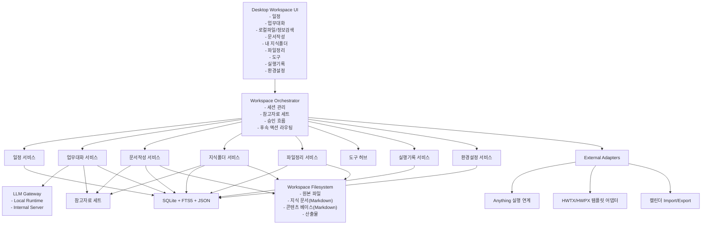
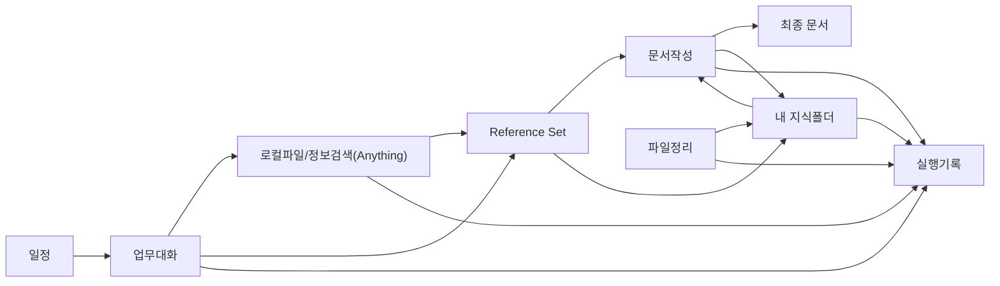

# 공무 로컬 에이전트 워크스페이스 마스터 개발 계획서

> **For agentic workers:** REQUIRED SUB-SKILL: Use `superpowers:subagent-driven-development` (recommended) or `superpowers:executing-plans` when converting this master plan into implementation work. This document is a product-level master plan, so execution 전에 기능군별 세부 구현 계획으로 다시 분할하는 것을 권장한다.

**Goal:** 공공기관 내부망의 개인 업무용 Windows PC에서 일정, 업무대화, 로컬 검색 연계, 문서작성, 지식폴더, 파일정리, 도구 실행을 하나의 로컬 우선 워크스페이스로 연결한다.

**Architecture:** Windows 중심 데스크톱 앱 위에 업무 오케스트레이션 계층을 두고, Markdown 중심 콘텐츠 베이스와 SQLite 기반 메타데이터를 결합한다. 로컬파일/정보검색은 외부 프로그램 `Anything`을 실행 연계하고, 문서작성은 `콘텐츠 베이스 -> 양식 선택 -> 양식 적용 -> 최종 산출` 파이프라인으로 분리한다.

**Tech Stack:** `.NET 8`, `WPF`, `SQLite`, `SQLite FTS5/JSON`, `Markdown`, Windows 파일시스템/프로세스 연동, 선택형 LLM Provider(Local/Internal), HWPX/HWTX 템플릿 어댑터

---

## 0. 계획서 성격

이 문서는 전체 제품을 한 번에 구현하기 위한 코드 작업지시서가 아니라, 실제 착수 가능한 수준으로 구조와 우선순위를 정의한 **마스터 개발 계획서**다.

다만 이 제품은 기능군이 분명히 나뉘므로, 실제 개발 시작 전에는 아래 5개 Epic 단위의 세부 구현 계획으로 쪼개는 것이 바람직하다.

1. 데스크톱 셸 / 공통 데이터 / 승인 / 실행기록
2. 일정 / 업무대화 / 참고자료 세트
3. 내 지식폴더 / 반영 후보 / 그래프 탐색
4. 문서작성 / 콘텐츠 베이스 / 템플릿 적용
5. 파일정리 / 도구 / 외부 연계 / 배포

---

## 1. 이 프로젝트에 대한 한 줄 해석

**공무**는 단순한 로컬 챗봇이 아니라, 공공기관 사무업무자가 자신의 일정, 대화, 검색, 지식, 문서, 파일을 하나의 로컬 우선 워크스페이스 안에서 연결해 운영하는 **개인 업무 운영체제**다.

---

## 2. 전체 제품 구조 해석

이 제품은 메뉴를 나열한 앱이 아니라, 아래 4개의 핵심 루프가 서로 이어지는 구조로 보는 것이 맞다.

### 2.1 업무 실행 루프

`일정 -> 업무대화 -> 참고자료 확보 -> 문서작성/정리 -> 실행기록`

- 일정은 단순 캘린더가 아니라 “오늘 무엇을 준비해야 하는가”를 여는 시작점이다.
- 업무대화는 답변만 하는 UI가 아니라 다음 행동을 분기시키는 라우터다.
- 결과는 문서, 지식 반영, 파일정리, 후속 일정으로 이어진다.

### 2.2 지식 성장 루프

`원본 파일/검색 결과 -> 반영 후보 -> 승인 -> 지식 문서/링크 갱신 -> 재사용`

- 지식폴더는 검색 인덱스가 아니라 구조화된 개인 위키여야 한다.
- 원본은 그대로 두고, 그 위에 주제/사안/프로젝트 중심의 구조화 레이어를 만든다.
- 파일정리와 최근 변경 감지는 이 루프를 유지하는 장치다.

### 2.3 문서 생산 루프

`업무 요청 -> 참고자료 선택 -> 콘텐츠 베이스(md) -> 양식 선택 -> 양식 적용/편집 -> 최종 문서 -> 지식 환류`

- 가장 중요한 설계 포인트는 “바로 HWPX를 생성하지 않는 것”이다.
- 콘텐츠 베이스를 먼저 만들고, 그 다음에 양식 적합화를 수행해야 재사용성과 추적성이 확보된다.

### 2.4 안전 운영 루프

`제안 -> 미리보기 -> 승인/거부 -> 실제 적용 -> 실행기록`

- 파일 이동, 지식 반영, 문서 저장, 외부 실행, 자동실행 반영은 모두 승인 흐름에 들어가야 한다.
- 실행기록은 시스템 로그가 아니라 사용자가 이해하는 작업 이력이어야 한다.

### 2.5 제품 도메인 구조

| 도메인 | 핵심 역할 | 주 데이터 |
| --- | --- | --- |
| 일정 | 업무 시작점, 작업 연결 허브 | 일정 항목, 연결 작업, 연결 문서 |
| 업무대화 | 자연어 업무 요청 라우터 | 업무 세션, 참고자료 세트, 후속 액션 |
| 로컬파일/정보검색 | 외부 검색 실행 진입점 | 외부 실행 설정, 참조된 파일 경로 |
| 문서작성 | 콘텐츠 베이스와 산출물 생성 | 콘텐츠 베이스, 템플릿, 산출물 |
| 내 지식폴더 | 구조화된 개인 위키 | 지식 소스, 지식 문서, 링크 그래프 |
| 파일정리 | 지식관리형 정리 제안 | 정리 제안, 최근 변경분, 반영 후보 |
| 도구 | 보조 기능 실행 허브 | 도구 매니페스트, 실행 결과 |
| 실행기록 | 추적성과 승인 이력 | 이벤트 로그, 승인 티켓, 산출물 링크 |
| 환경설정 | 개인 업무환경 정책 | 폴더 경로, 승인 정책, LLM/외부도구 설정 |

---

## 3. 전체 아키텍처 제안

### 3.1 권장 아키텍처 스타일

**Windows 데스크톱 워크스페이스 + 로컬 서비스 계층 + 파일시스템/지식 레이어 분리 구조**

- UI는 기능별 독립 작업공간을 가진 데스크톱 앱으로 구성한다.
- 핵심 비즈니스 로직은 기능별 서비스로 분리한다.
- 파일 원본, 구조화된 지식, 메타데이터 DB, 실행기록을 분리 저장한다.
- 외부 검색과 문서 양식 적용은 어댑터 계층으로 감싼다.

### 3.2 논리 아키텍처



### 3.3 물리 저장 구조 제안

```text
%USERPROFILE%\Gongmu\
  app\
  workspace\
    config\
    db\
      gongmu.db
    knowledge\
      sources\
      structured\
        topics\
        entities\
        issues\
        projects\
      inbox\
      graph\
    documents\
      content-bases\
      drafts\
      outputs\
      templates\
    logs\
    cache\
```

### 3.4 공통 데이터 원칙

- **원본 우선 보존:** 원본 파일은 가능하면 이동보다 참조를 우선한다.
- **Markdown 우선:** 지식 문서와 콘텐츠 베이스는 Markdown 중심으로 저장한다.
- **DB는 인덱스/상태용:** SQLite는 메타데이터, 링크, 작업상태, 승인, 로그를 관리한다.
- **모든 주요 결과는 Artifact화:** 문서, 요약, 반영 결과, 정리 결과는 모두 링크 가능한 산출물로 남긴다.

---

## 4. 권장 기술스택 제안

### 4.1 최종 권장 스택

**권장안: `.NET 8 + WPF + SQLite + Markdown Files + Windows Integration Adapter`**

### 4.2 권장 스택 구성

| 영역 | 권장 기술 | 이유 |
| --- | --- | --- |
| 데스크톱 셸 | `.NET 8 WPF` | Windows 전용 환경에 최적, 기업/관공서 배포 친화적, 파일/프로세스/권한 연계가 안정적 |
| UI 패턴 | `MVVM` | 화면별 작업공간을 독립 구성하기 좋고 테스트/유지보수에 유리 |
| 로컬 저장소 | `SQLite` | 설치 부담이 낮고 단일 파일 배포 가능 |
| 검색/메타데이터 | `SQLite FTS5` + `SQLite JSON` | 실행기록, 지식 링크, 설정, 후보 상태를 한 DB 안에서 다루기 좋음 |
| 지식 자산 | `Markdown + Front Matter` | 재사용, diff, 추적, 템플릿 연결에 유리 |
| 그래프 보기 | WebView 기반 그래프 컴포넌트 | 관계도/지식맵 시각화에 적합 |
| LLM 계층 | OpenAI-compatible Provider Adapter + Local Runtime Adapter | 내부망 서버/로컬 런타임을 모두 수용 |
| 문서 파이프라인 | Markdown 콘텐츠 베이스 + 템플릿 프로파일 + HWPX/HWTX Adapter | 요구된 문서작성 프로세스를 직접 반영 |
| 외부 검색 연계 | Windows 프로세스 실행/링크 호출 | `Anything`을 별도 개발 없이 연계 가능 |
| 배포 | 오프라인 설치 패키지(MSI 중심) | 내부망/관리자 배포에 적합 |

### 4.3 권장 세부 구현 원칙

- UI는 “하나의 채팅창”이 아니라 **작업공간 기반**으로 만든다.
- 핵심 업무 데이터는 SQLite에 두되, 사용자가 직접 접근/백업할 가치가 있는 산출물은 파일로 저장한다.
- 기능 간 연결의 핵심 단위는 아래 6개로 통일한다.
  - `WorkSession`
  - `ReferenceSet`
  - `KnowledgeCandidate`
  - `ContentBase`
  - `ApprovalTicket`
  - `Artifact`

---

## 5. 대안 기술스택 비교

### 5.1 비교안

| 안 | 구성 | 장점 | 단점 | 적합도 |
| --- | --- | --- | --- | --- |
| A. 권장안 | `.NET 8 + WPF + SQLite` | Windows/내부망/파일시스템/프로세스 연계에 가장 강함, 공공기관 배포와 Hancom/Windows 연계에 유리 | 웹 인력 중심 팀이면 UI 생산성이 떨어질 수 있음 | **가장 적합** |
| B. 웹 기술 선호안 | `Tauri 2 + React + Rust + SQLite` | 설치 크기와 보안 경계가 좋고, web UI 생산성이 높음 | Windows/Hancom/기업 배포 세부 연계는 별도 adapter 설계가 더 필요 | 조건부 적합 |
| C. 웹 앱 친화안 | `Electron + React + Node + SQLite` | 웹 팀 생산성이 높고 생태계가 풍부 | 배포 무게와 런타임 표면이 큼, 공공기관 Windows 업무도구로는 과할 수 있음 | 후순위 |

### 5.2 왜 A안이 우선인가

- 이 제품의 기본 타깃은 크로스플랫폼 소비자 앱이 아니라 **Windows 내부망 사무업무자용 개인 워크스페이스**다.
- 문서 양식, 파일시스템, 외부 실행, 설치/업데이트, 승인형 파일 작업은 Windows 네이티브 친화성이 높을수록 유리하다.
- 향후 Hancom/HWPX/HWTX, 내부 보안도구, 사내 배포체계와 붙을 가능성까지 고려하면 `.NET + WPF`가 리스크가 가장 낮다.

### 5.3 B안이 맞는 경우

- 팀이 Rust/TypeScript 역량이 강하고 웹 UI 반복 속도가 매우 중요할 때
- 장기적으로 Windows 외 확장을 강하게 염두에 둘 때
- 문서 양식과 Windows 연계는 sidecar/adapter로 별도 분리할 수 있을 때

### 5.4 C안이 후순위인 이유

- Electron은 공식 문서상 `main`, `renderer`, `utility process` 등 다중 프로세스 구조를 가지며 Node/Electron 경계 관리가 필수다. 이는 장점도 있지만, 이 제품처럼 내부망 Windows 업무도구를 안정적으로 운영해야 하는 경우엔 런타임 면적과 패키지 무게가 상대적으로 커진다. 이 평가는 공식 문서의 구조 설명을 바탕으로 한 아키텍처적 추론이다.

---

## 6. 핵심 기능별 구현 방식

## 6.1 일정

### 역할

- 업무의 시작점
- 일정과 작업, 문서, 대화, 자동실행을 잇는 허브

### 구현 방식

- `CalendarItem`에 단순 시간 정보만 두지 않고 아래 연결 필드를 둔다.
  - `linkedWorkSessionId`
  - `linkedDocumentJobs[]`
  - `prepActions[]`
  - `resultArtifacts[]`
- 화면은 `월 / 주 / 목록` 3가지 보기로 제공한다.
- 일정 생성 시 “이 일정 전에 필요한 준비 작업”과 “끝난 뒤 남길 결과물”을 함께 정의할 수 있게 한다.
- 일정 상세 화면에서 바로 아래 액션을 제공한다.
  - `업무대화 열기`
  - `문서 초안 시작`
  - `참고자료 확인`
  - `자동실행 예약`

### 구현 우선순위

1. 로컬 일정 CRUD와 목록/주/월 보기
2. 일정과 업무세션 연결
3. 일정과 문서작업 연결
4. 준비작업/후속산출물 템플릿
5. ICS Import/Export 또는 외부 캘린더 연계

### 핵심 데이터

- `CalendarItem`
- `TaskLink`
- `PrepAction`
- `FollowupArtifact`

## 6.2 업무대화

### 역할

- 질의응답 창이 아니라 업무 요청의 라우터

### 구현 방식

- 대화는 반드시 `WorkSession` 단위로 저장한다.
- 세션마다 참조 범위를 명시한다.
  - 선택한 파일
  - 선택한 폴더
  - 선택한 지식폴더
  - 선택한 일정
  - 선택한 Reference Set
- 응답은 단순 텍스트만 주지 않고, 아래 구조를 함께 제공한다.
  - `답변`
  - `출처`
  - `다음 행동 제안`
  - `문서로 넘기기`
  - `지식 반영 후보 만들기`
  - `일정과 연결하기`

### UI 핵심

- 좌측: 세션 목록
- 중앙: 현재 대화
- 우측: 참조 자료 / 출처 / 다음 행동

### 구현 우선순위

1. 세션 기반 대화 저장
2. 참조 범위 선택
3. 출처 표시
4. 후속 액션 버튼
5. 일정/문서/지식폴더 직접 연결

## 6.3 로컬파일/정보검색 연계

### 역할

- 검색 기능 자체를 개발하지 않고, 검색으로 이동하는 **업무 흐름의 입구**를 제공

### 구현 방식

- `Anything`은 앱 내부 기능이 아니라 외부 실행 대상이다.
- 설정에 `Anything 실행 경로` 또는 `실행 링크`를 둔다.
- 메뉴 진입 시 아래 동작을 제공한다.
  - `Anything 열기`
  - `사용 방법 안내`
  - `검색 후 참고자료로 가져오기`
- 검색 결과를 이 앱 안으로 “자동 파싱”하는 것은 초기 전제로 두지 않는다.
- 대신 아래 2단계 연계 구조를 둔다.
  1. **외부 실행 단계:** `Anything`을 열어 사용자가 검색
  2. **후속 활용 단계:** 사용자가 파일 경로나 선택한 결과를 `Reference Set`으로 가져옴

### 현실적 연계 레벨

- `Level 1`: 외부 프로그램 실행만 지원
- `Level 2`: 최근 선택 파일 경로 붙여넣기/드래그 앤 드롭/클립보드 기반 참조 등록
- `Level 3`: 가능하다면 custom protocol 또는 command-line 연계를 추가 검토

### 구현 우선순위

1. `Anything` 동봉 설치 및 경로 탐지
2. 외부 실행 버튼
3. 검색 후 참고자료 가져오기 UX
4. 대화/문서/지식폴더로 보내기

## 6.4 문서작성

### 역할

- 업무대화와 지식폴더의 내용을 실제 공공기관 문서 산출물로 변환

### 구현 방식

문서작성은 반드시 아래 4단계 파이프라인으로 구현한다.

1. `Reference Set` 구성
2. `Content Base` 생성(Markdown)
3. `Template Profile` 선택
4. `Template Application Job` 수행 후 최종 산출

### 문서작성 내부 모델

- `DocumentJob`: 문서 하나를 만드는 작업 단위
- `ReferenceSet`: 문서의 근거 자료 묶음
- `ContentBase`: Markdown 기반 중간 산출물
- `TemplateProfile`: 내부 템플릿 또는 사용자 제공 양식 정의
- `OutputArtifact`: 최종 HWPX/HWTX/기타 산출물

### 화면 흐름

1. 문서 목적 선택
2. 참고자료 선택
3. 콘텐츠 베이스 초안 생성
4. 사용자가 구조 검토/수정
5. 양식 선택
6. 양식 적합화 미리보기
7. 최종 저장 승인

### 템플릿 전략

- **1차:** 내부 탑재 템플릿(보고서, 회의자료, 검토보고 등)
- **2차:** 사용자 제공 HWPX/HWTX 템플릿 매핑
- **3차:** 템플릿별 필수 항목 자동검사

### 중요한 설계 포인트

- 콘텐츠 베이스는 최종 문서보다 오래 살아남는 자산이다.
- 같은 주제로 다른 양식을 반복 생성할 수 있도록 `Content Base`를 독립 보존한다.
- 출처와 인용 근거를 콘텐츠 베이스 단계부터 붙인다.

### 구현 우선순위

1. Markdown 콘텐츠 베이스 생성/편집
2. 내부 템플릿 2~3종
3. 양식 적합화 미리보기
4. 최종 산출물 저장
5. 사용자 제공 HWPX/HWTX 어댑터

## 6.5 내 지식폴더

### 역할

- 원본 파일을 지식으로 성장시키는 개인 위키 / 제2의 브레인

### 구현 방식

- 지식폴더는 `원본 레이어`와 `구조화 레이어`를 분리한다.
- 사용자가 하나 이상의 폴더를 `Knowledge Source`로 등록한다.
- 스캔 결과를 바로 지식에 반영하지 않고 `Knowledge Candidate`로 넣는다.
- 사용자가 승인하면 아래 타입의 구조화 문서를 만든다.
  - `Topic Page`
  - `Issue Page`
  - `Project Page`
  - `Entity Page`
  - `Comparison Page`

### 구조 제안

- 원본 파일은 실제 폴더에 그대로 남긴다.
- 구조화 문서는 앱의 `knowledge/structured/` 아래 Markdown으로 축적한다.
- DB에는 아래 메타를 저장한다.
  - 원본 경로
  - 추출 요약
  - 관련 주제
  - 링크 관계
  - 근거 문단 위치
  - 최근 반영 상태

### 지향 UX

- 파일 목록보다 “주제 페이지”가 먼저 보이게 한다.
- 주제별로 연결된 문서, 사람, 사업, 회의, 보고 이력을 볼 수 있어야 한다.
- 최근 변경분은 “지식 반영 후보”로 별도 큐에 쌓여야 한다.

### 구현 우선순위

1. 폴더 등록
2. 반영 후보 큐
3. 주제/프로젝트 페이지 생성
4. 링크 그래프 보기
5. 최근 변경 감지와 재반영

## 6.6 파일정리

### 역할

- 폴더 정리 기능이 아니라, 지식구조를 강화하는 승인형 분류 엔진

### 구현 방식

- 대상 폴더를 선택하면 앱이 최근 변경 파일과 구조 어긋남을 분석한다.
- 결과는 자동 적용이 아니라 `정리 제안`으로만 표시한다.
- 각 제안은 아래 4종으로 나눈다.
  - `이동 제안`
  - `분류 제안`
  - `지식 반영 후보`
  - `보관/아카이브 제안`

### 핵심 로직

- 규칙 기반으로 시작한다.
  - 폴더 패턴
  - 파일명 패턴
  - 최근 편집 시점
  - 연결된 일정/프로젝트/주제
- 이후 사용자의 승인 패턴을 학습해 추천 정확도를 높인다.

### 중요한 제약

- 이동/삭제는 항상 승인 필요
- 파일 이동 후에는 지식 링크와 참조 경로를 같이 갱신
- “정리”와 “지식 반영”을 분리 기록

### 구현 우선순위

1. 최근 변경 감지
2. 정리 제안 목록
3. 승인 후 적용
4. 지식 반영과 링크 갱신
5. 사용자별 정리 규칙 학습

## 6.7 도구

### 역할

- 제품의 확장 기능 허브

### 구현 방식

- 도구는 `Tool Manifest` 기반으로 등록한다.
- 각 도구는 아래 메타를 가진다.
  - 이름
  - 설명
  - 입력 형식
  - 출력 형식
  - 위험도
  - 승인 필요 여부
  - 연결 가능한 기능

### 예시 도구

- OCR
- 문서 요약
- 메타데이터 정리
- 대량 파일명 정리
- 지식 반영 보조
- 문서 템플릿 점검

### 구현 우선순위

1. 도구 레지스트리
2. 도구 실행/결과 저장
3. 문서/지식/파일정리에서 도구 호출
4. 승인 정책 연동

## 6.8 실행기록

### 역할

- 시스템 로그가 아니라 사용자 중심 작업 이력

### 구현 방식

- 모든 핵심 동작은 `ExecutionEvent`로 남긴다.
- 이벤트는 읽기 쉬운 작업 단위로 그룹핑한다.
- 기록 상세에는 아래를 보여준다.
  - 언제
  - 누가(기본은 현재 사용자)
  - 어떤 기능
  - 어떤 입력 자료
  - 어떤 결과
  - 승인/거부 여부
  - 성공/실패 여부
  - 연결된 산출물

### 우선 노출 대상

- 문서작성 이력
- 지식 반영 이력
- 파일정리 이력
- 자동실행 이력

## 6.9 환경설정

### 역할

- 개인 업무환경과 정책을 제어하는 영역

### 구현 방식

- 최소한 아래 설정을 제공한다.
  - 기본 작업 폴더
  - 기본 지식폴더
  - 기본 양식 경로
  - `Anything` 실행 경로
  - 승인 정책
  - 자동실행 정책
  - LLM Provider 설정
  - 내부 서버 URL(선택)

### 정책 구조

- `Global Settings`
- `Workspace Settings`
- `Knowledge Policy`
- `Approval Policy`
- `Tool Policy`

---

## 7. 기능 간 연결 구조 설계

### 7.1 공통 연결 단위

기능들을 느슨하게 연결하려면 모든 기능이 아래 공통 객체를 공유해야 한다.

| 공통 객체 | 설명 | 연결되는 기능 |
| --- | --- | --- |
| `WorkSession` | 대화/작업 단위 | 일정, 업무대화, 문서작성, 실행기록 |
| `ReferenceSet` | 근거 자료 묶음 | 업무대화, 검색 연계, 문서작성, 지식반영 |
| `KnowledgeCandidate` | 반영 대기 항목 | 검색 연계, 지식폴더, 파일정리 |
| `ContentBase` | Markdown 중간 산출물 | 업무대화, 문서작성, 지식폴더 |
| `ApprovalTicket` | 승인 필요 작업 | 파일정리, 지식반영, 문서저장, 외부실행 |
| `Artifact` | 결과 산출물 | 문서, 요약, 로그, 반영 결과 |

### 7.2 사용자 흐름 기준 연결



### 7.3 시스템 흐름 기준 연결

1. 일정이 특정 업무세션을 연다.
2. 업무세션이 필요한 참고자료를 선택한다.
3. 필요 시 `Anything`을 외부 실행해 자료를 찾는다.
4. 검색 결과나 파일 경로를 `Reference Set`으로 등록한다.
5. `Reference Set`은 대화 답변, 지식 반영, 문서작성의 공통 근거가 된다.
6. 문서작성은 `Content Base`를 만들고 템플릿을 적용한다.
7. 파일정리는 최근 변경분을 감지해 지식 반영 후보를 만든다.
8. 모든 승인/반영/실행 결과는 실행기록으로 남는다.

### 7.4 가장 중요한 연결 규칙

- 검색은 외부 기능이지만, **검색 후 활용**은 반드시 이 앱 안으로 돌아와야 한다.
- 문서작성의 입력은 항상 `Reference Set` 또는 `Knowledge Page`로 추적 가능해야 한다.
- 파일정리와 지식반영은 분리되어 보이되, 실제로는 한 루프를 이뤄야 한다.

---

## 8. MVP 범위 제안

### 8.1 MVP 목표

“오늘 대화에서 시작해, 필요하면 일정과 연결하고, 필요한 자료를 외부 검색으로 찾고, 지식폴더와 연결한 뒤, Markdown 콘텐츠 베이스를 거쳐 실제 초안 문서를 남기는 흐름”을 단일 사용자 로컬 환경에서 완성한다.

### 8.2 MVP에 포함할 것

1. Windows 데스크톱 앱 기본 셸
2. 일정 CRUD + 일정-업무세션 연결
3. 업무대화 세션 + 출처 표시 + 후속 액션
4. `Anything` 외부 실행 + 참고자료 등록 UX
5. 지식폴더 등록 + 반영 후보 큐 + 주제 페이지 생성
6. 문서작성의 `Content Base(md)` 생성/편집
7. 내부 템플릿 2~3종 적용
8. 파일정리의 최근 변경 감지 + 승인형 정리 제안
9. 승인 흐름 + 실행기록

### 8.3 MVP에서 제한할 것

- 다중 사용자 협업
- 자유 레이아웃 편집기
- 복잡한 자율 멀티에이전트
- 모바일
- 완전 자동 파일 이동
- 임의 HWP 바이너리 직접 고도 처리

### 8.4 MVP 문서 범위 권장

- `보고서형`
- `회의자료형`
- `검토메모형`

이 3종 정도를 먼저 내부 템플릿으로 지원하고, 사용자 제공 HWPX/HWTX 양식은 Beta 또는 PoC로 둔다.

---

## 9. 단계별 빌드 계획

아래 단계는 2~4인 팀이 2주 스프린트로 진행한다는 가정에서 작성했다. 절대 일정이 아니라 **의존관계와 우선순위 중심**의 단계다.

### Phase 0. 기반 골격

**목표:** 앱이 돌아가고, 데이터를 저장하고, 승인과 기록이 가능한 최소 플랫폼을 만든다.

**산출물**

- 데스크톱 셸
- 좌/중/우 공통 레이아웃
- SQLite 초기 스키마
- 설정 저장
- 승인 티켓 기본 모델
- 실행기록 기본 모델

**왜 먼저 해야 하나**

- 이후 모든 기능이 승인, 로그, 설정을 공유하기 때문이다.

### Phase 1. 업무 허브 최소 흐름

**목표:** 일정에서 업무대화를 열고, 참고자료를 지정해 대화하는 흐름을 만든다.

**산출물**

- 일정 CRUD
- WorkSession 생성/연결
- 업무대화 세션 저장
- 출처 표시 기본 UI
- `Reference Set` 모델

**완료 기준**

- 일정 하나에서 대화를 열고, 세션을 다시 이어서 볼 수 있다.

### Phase 2. 외부 검색 연계

**목표:** `Anything`을 외부 실행하고, 검색 이후 결과를 업무 흐름 안으로 되가져온다.

**산출물**

- `Anything` 경로 탐지/설정
- 외부 실행 버튼
- 검색 후 파일 경로를 `Reference Set`으로 가져오는 UX
- 외부 실행 승인 기록

**완료 기준**

- 사용자가 검색을 마친 뒤 선택 파일을 대화/문서 흐름으로 넘길 수 있다.

### Phase 3. 내 지식폴더 1차

**목표:** 특정 폴더를 등록하고, 반영 후보와 주제 페이지를 만들 수 있게 한다.

**산출물**

- Knowledge Source 등록
- 파일 스캔
- 반영 후보 큐
- Topic/Project Page Markdown 생성
- 링크 그래프 초안

**완료 기준**

- 최근 추가/수정 파일을 지식 반영 후보로 보고 승인 후 페이지를 생성할 수 있다.

### Phase 4. 문서작성 1차

**목표:** 대화/지식/참고자료를 기반으로 콘텐츠 베이스를 만들고 내부 템플릿에 적용한다.

**산출물**

- DocumentJob
- ContentBase 편집기
- 내부 템플릿 2~3종
- 양식 적합화 화면
- 최종 산출물 저장

**완료 기준**

- 하나의 업무세션에서 초안 문서를 끝까지 만들어 저장할 수 있다.

### Phase 5. 파일정리 1차

**목표:** 최근 변경 파일과 구조 어긋남을 감지하고 승인형 정리 제안을 수행한다.

**산출물**

- 변경 감지
- 정리 제안 리스트
- 승인 후 이동/분류 적용
- 지식 링크 갱신

**완료 기준**

- 정리 결과와 지식 반영 결과가 각각 기록된다.

### Phase 6. 문서 양식 고도화

**목표:** HWPX/HWTX 템플릿을 실제 업무 문서 흐름에 붙인다.

**산출물**

- 사용자 제공 템플릿 등록
- 템플릿 프로파일 매핑
- HWPX/HWTX 적용 PoC
- 양식별 필수 항목 점검

**완료 기준**

- 사용자 제공 양식 1~2종을 실제로 적용 가능한 상태가 된다.

### Phase 7. 운영 안정화

**목표:** 내부망 배포와 실사용 안정성을 높인다.

**산출물**

- 오프라인 설치 패키지
- 오류 진단 개선
- 대용량 폴더 성능 튜닝
- 정책/권한/기록 강화
- 캘린더 Import/Export

---

## 10. 가장 먼저 검증해야 할 PoC 3~5개

### PoC 1. Windows 데스크톱 셸 + 승인/기록 최소 구조

**검증 질문**

- 공공기관 PC에서 설치/실행/설정 저장이 안정적인가
- 승인형 동작과 작업 이력을 사용자 친화적으로 보여줄 수 있는가

**성공 기준**

- 파일 이동/외부실행/문서저장 같은 작업이 승인 티켓과 로그로 남는다

### PoC 2. `Anything` 외부 실행과 업무 흐름 복귀

**검증 질문**

- 사용자가 앱에서 자연스럽게 검색으로 넘어갔다가 돌아올 수 있는가
- 복잡한 자동 연동 없이도 `Reference Set`을 구성할 수 있는가

**성공 기준**

- 검색 후 선택한 파일 경로를 대화/문서작성에 바로 쓸 수 있다

### PoC 3. 지식폴더 반영 후보 -> 주제 페이지 생성

**검증 질문**

- 원본 파일을 보존하면서 구조화 레이어를 잘 쌓을 수 있는가
- “반영 후보” 개념이 실제 사용성에 도움이 되는가

**성공 기준**

- 최근 변경 파일 하나를 승인해 주제 페이지와 링크를 생성할 수 있다

### PoC 4. Markdown 콘텐츠 베이스 -> 내부 템플릿 적용

**검증 질문**

- 문서작성이 정말 `콘텐츠 베이스 중심`으로 굴러가는가
- 양식 적용 전/후를 분리했을 때 사용자가 이해하기 쉬운가

**성공 기준**

- 보고서형 또는 회의자료형 문서를 Markdown 기반에서 최종 초안까지 만들 수 있다

### PoC 5. HWPX/HWTX 템플릿 어댑터 가능성

**검증 질문**

- 사용자 제공 양식 1종을 실제로 연결할 수 있는가
- HWPX/HWTX 변환/적용 리스크가 어느 정도인가

**성공 기준**

- 최소 1종 양식에 대해 필드 매핑 또는 구조 매핑이 검증된다

---

## 11. 주요 리스크와 대응 방안

| 리스크 | 내용 | 대응 방안 |
| --- | --- | --- |
| HWPX/HWTX 적용 복잡성 | 양식 구조가 제각각이고 Hancom 연계 방식이 달라질 수 있음 | MVP는 내부 템플릿 우선, 사용자 제공 양식은 PoC 후 단계적 확장 |
| 로컬 LLM 성능 편차 | 사용자 PC 사양 차이가 크고 내부망 정책이 다를 수 있음 | Provider Adapter 구조로 설계해 local/internal server를 모두 지원 |
| 검색 연계 한계 | `Anything`이 외부 프로그램이라 깊은 통합이 제한될 수 있음 | 앱은 검색 엔진이 아니라 검색 후 활용 흐름에 집중, Reference Set UX 강화 |
| 지식반영 과잉 자동화 | 사용자가 원하지 않는 요약/구조화가 누적될 위험 | 반영 후보 큐와 승인형 반영을 기본 정책으로 채택 |
| 파일정리 신뢰 부족 | 자동 이동/정리 불신이 클 수 있음 | 제안형 구조 유지, 미리보기와 rollback 가능한 로그 설계 |
| 내부망 배포 이슈 | 설치 권한, 업데이트 통제, 외부 네트워크 제약 | 오프라인 설치 패키지, 외부 연결 기본 비활성, 설정 가능한 내부 경로 사용 |
| 추적성 부족 | 나중에 왜 이런 결과가 나왔는지 설명이 어려워질 수 있음 | Content Base, Reference Set, Approval, Artifact를 모두 실행기록과 연결 |

---

## 12. 왜 이 기술 선택이 적절한지

### 12.1 `.NET 8 + WPF`가 맞는 이유

- 이 제품은 Windows 전용 업무도구에 가깝다.
- WPF는 Microsoft 공식 문서 기준으로 Windows 전용 UI 프레임워크이며, .NET 기반 최신 API, 성능, 접근성 개선을 활용할 수 있다.
- 공공기관 환경에서는 브라우저형 SaaS보다 로컬 설치형 Windows 앱이 관리와 배포 측면에서 더 현실적이다.

### 12.2 `SQLite`가 맞는 이유

- 별도 서버 없이도 로컬 상태를 충분히 담을 수 있다.
- 공식 문서 기준 FTS5는 full-text query, relevance ordering, highlight/snippet 등을 제공해 작업기록/지식메타 조회에 적합하다.
- JSON 함수가 기본 포함되어 있어 설정, 승인, 후보 상태, 도구 결과 메타를 유연하게 저장할 수 있다.

### 12.3 Markdown 중심이 맞는 이유

- 지식 문서와 콘텐츠 베이스를 텍스트 자산으로 장기 보존할 수 있다.
- diff, 백업, 재활용, 템플릿 변환에 강하다.
- 문서작성 프로세스의 핵심인 “내용과 양식의 분리”를 구현하기 좋다.

### 12.4 HWPX/HWTX 어댑터 분리가 맞는 이유

- Hancom 공식 안내에 따르면 HWP는 바이너리라 직접 읽기 어렵지만, HWPX는 개방형 포맷이며 HWPX 변환기도 제공된다.
- 따라서 문서 파이프라인은 처음부터 HWPX/HWTX를 핵심 종착지 중 하나로 고려하되, 앱 내부 핵심 모델은 포맷 독립적인 `Content Base` 중심으로 설계해야 리스크가 줄어든다.

### 12.5 `Anything` 외부 연계가 맞는 이유

- 사용자가 이미 원하는 검색 경험이 있고, 이 프로젝트의 핵심 가치는 검색 엔진 재개발이 아니라 **검색 이후의 업무 연결성**에 있다.
- 따라서 검색 기능은 외부에 두고, 본 제품은 참고자료 세트, 지식 반영, 문서화, 작업 연결을 강화하는 쪽이 투자 대비 가치가 높다.

---

## 13. 최종 추천안

### 13.1 최종 추천 구조

**1차 제품 전략**

- `Windows 전용 로컬 워크스페이스`
- `.NET 8 + WPF`
- `SQLite + Markdown`
- `Anything 외부 실행 연계`
- `Content Base 중심 문서작성`
- `Knowledge Candidate 중심 지식폴더`
- `승인형 파일정리`
- `Execution Log 중심 추적성`

### 13.2 제품의 핵심 차별화

이 제품의 차별점은 LLM 성능 자체가 아니라 아래 연결 구조다.

1. 일정이 업무를 연다.
2. 업무대화가 작업을 분기한다.
3. 검색은 외부에서 하되 결과는 내부 흐름으로 되가져온다.
4. 지식폴더는 파일 저장소가 아니라 개인 위키가 된다.
5. 문서작성은 Markdown 콘텐츠 베이스를 중심으로 돈다.
6. 파일정리는 지식관리와 연결된다.
7. 모든 중요한 작업은 승인과 기록을 남긴다.

### 13.3 실행 권고

이 마스터 계획을 바로 구현에 들어가기보다, 아래 순서로 세부 실행계획으로 분할하는 것을 권장한다.

1. 기반 셸/승인/기록
2. 일정/업무대화/Reference Set
3. 지식폴더/반영 후보
4. 문서작성/내부 템플릿
5. 파일정리/도구/외부연계
6. HWPX/HWTX 고도화

### 13.4 한 문장 결론

가장 현실적이고 성공 가능성이 높은 방향은 **Windows 로컬 앱을 중심으로, 검색은 외부 연계하고, 지식과 문서는 Markdown 기반 중간 산출물로 묶는 구조**다.

---

## 참고 근거

- Tauri sidecar / permissions / capabilities: [tauri.app](https://tauri.app/develop/sidecar/)
- Tauri WebView2 on Windows: [v2.tauri.app](https://v2.tauri.app/reference/webview-versions/)
- Electron process model: [electronjs.org](https://www.electronjs.org/docs/latest/tutorial/process-model)
- WPF overview and .NET benefits: [learn.microsoft.com](https://learn.microsoft.com/en-us/dotnet/desktop/wpf/overview/)
- WebView2 distribution: [learn.microsoft.com](https://learn.microsoft.com/en-us/microsoft-edge/webview2/concepts/distribution)
- SQLite FTS5: [sqlite.org/fts5.html](https://www.sqlite.org/fts5.html)
- SQLite JSON: [sqlite.org/json1.html](https://www.sqlite.org/json1.html)
- Hancom HWP/HWPX guidance: [hancom.com support FAQ](https://www.hancom.com/support/faqCenter/faq/detail/3135)
