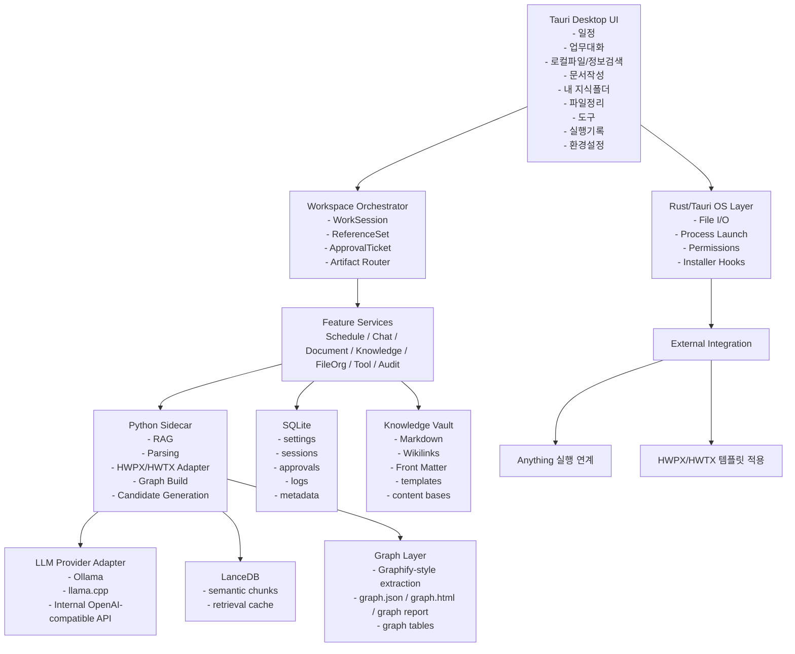
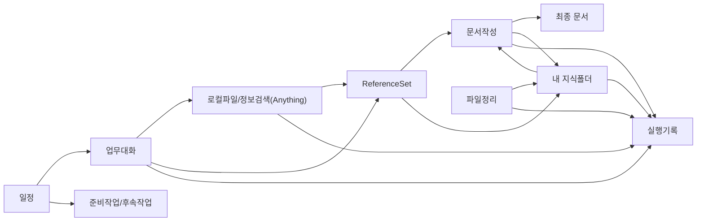

# 로컬 에이전트 워크스페이스 "공무" — 최종 통합 개발 계획서 v2

> 공공기관 사무업무자를 위한 로컬 우선 개인 업무 에이전트 워크스페이스  
> 통합 기준: Claude 4.7 계획서 + Gemini 3.1 계획서 + Codex 마스터 계획서 + 사용자 추가 요구사항 반영  
> 작성일: 2026-04-19

---

## 0. 통합 원칙

이 문서는 세 문서의 장점을 합쳐 다시 정리한 최종 통합판이다.

- `Claude` 문서의 장점: 기술 스택 구체성, PoC 기준, 설치/배포/성능 현실성
- `Gemini` 문서의 장점: 단순명료한 제품 해석, 결정론적 문서 파이프라인, 안전한 운영 태도
- `Codex` 문서의 장점: 공공기관 워크플로 정합성, 승인/기록/공통 데이터 모델, 기능 간 연결 구조

추가 반영한 사용자 요구는 아래 두 가지다.

1. 지식폴더는 `Obsidian 스타일 Markdown 구조 + Graph 구조/Graph DB 성격의 저장층 + RAG`를 함께 고려한다.
2. 기술스택은 `.NET`보다 `Tauri + Rust + React + Python` 축이 현 시점의 바이브코딩/사례 축적 측면에서 더 유리하다고 보고, 최종 권장안을 그쪽으로 조정한다.

---

## 1. 이 프로젝트에 대한 한 줄 해석

**공무**는 공공기관 내부망 Windows PC에서 일정, 대화, 검색, 지식, 문서, 파일을 하나의 흐름으로 연결해 주는 **로컬 우선형 개인 업무 운영체제**다.

---

## 2. 전체 제품 구조 해석

이 제품은 메뉴 나열형 앱이 아니라, 아래 4개의 순환 구조가 닫히는 워크스페이스로 보는 것이 맞다.

### 2.1 업무 실행 루프

`일정 -> 업무대화 -> 참고자료 확보 -> 문서작성 -> 실행기록`

- 일정은 단순 캘린더가 아니라 업무의 출발점이다.
- 업무대화는 챗봇이 아니라 의도를 기능으로 분기시키는 라우터다.
- 문서작성은 대화 결과를 실제 공공기관 산출물로 변환하는 생산 파이프라인이다.

### 2.2 지식 성장 루프

`원본 파일/검색 결과 -> 반영 후보 -> 승인 -> 지식 문서 갱신 -> 재사용`

- 지식폴더는 단순 검색 저장소가 아니라 개인 위키 / 제2의 브레인이다.
- 원본은 보존하고, 그 위에 구조화 문서와 링크 그래프를 얹어야 한다.
- 파일정리는 이 지식 루프를 최신 상태로 유지하는 장치다.

### 2.3 수집-축적-생산 루프

`수집(검색/대화) -> 축적(지식폴더/파일정리) -> 생산(문서작성/일정연결)`

- Gemini 문서의 장점처럼 이 제품은 사용자의 행위를 이 사이클로 묶어야 한다.
- 중요한 것은 개별 기능이 아니라 기능 간 연결성이다.

### 2.4 안전 운영 루프

`제안 -> 미리보기 -> 승인/거부 -> 적용 -> 실행기록`

- 파일 이동/삭제
- 지식폴더 구조 갱신
- 문서 최종 저장
- 외부 실행
- 자동실행 결과 반영

위 항목은 모두 승인 흐름을 통과해야 한다.

---

## 3. 전체 아키텍처 제안

### 3.1 최종 권장 아키텍처

**Tauri 기반 Windows 데스크톱 워크스페이스 + Python AI/Core Sidecar + Obsidian 호환 지식 볼트 + Graph 레이어 + Hybrid RAG**

### 3.2 구조 해석

### 3.3 핵심 설계 원칙

- UI는 채팅창 하나가 아니라 기능별 작업공간 구조를 따른다.
- 운영 데이터는 SQLite에, 재사용 자산은 Markdown 파일에 둔다.
- 검색은 외부에 두고, 검색 후 활용 흐름을 내부로 회수한다.
- 지식은 `Obsidian 호환 Vault`를 정본으로 삼고, 그래프와 RAG는 파생 레이어로 둔다.
- 문서작성은 반드시 `콘텐츠 베이스 -> 양식 적용` 2단 구조를 따른다.

### 3.4 공통 핵심 객체

세 문서를 통합한 결과, 아래 6개 객체를 전 기능 공통 모델로 두는 것이 가장 적절하다.

- `WorkSession`: 대화/작업 단위
- `ReferenceSet`: 참고자료 묶음
- `KnowledgeCandidate`: 지식 반영 대기 항목
- `ContentBase`: Markdown 기반 중간 산출물
- `ApprovalTicket`: 승인 필요 작업 단위
- `Artifact`: 문서/반영결과/로그 등 결과물 단위

---

## 4. 권장 기술스택 제안

### 4.1 최종 권장안

**권장안: `Tauri 2 + React + TypeScript + Python 3.11 Sidecar + SQLite + LanceDB + Obsidian-Compatible Markdown Vault + Graphify-style Graph Layer`**

### 4.2 세부 스택

| 영역 | 권장 기술 | 이유 |
| --- | --- | --- |
| 데스크톱 셸 | `Tauri 2` | Windows 리소스 사용량이 작고, Rust 기반 권한/프로세스 제어가 강함 |
| UI | `React 18 + TypeScript` | 사례가 많고 바이브코딩 친화적이며, 복잡한 작업공간 UI 구성에 유리 |
| 상태관리 | `Zustand + TanStack Query` | 가볍고 빠르게 조립 가능 |
| UI 스타일 | `TailwindCSS + shadcn/ui` | 빠른 프로토타이핑과 커스터마이징에 유리 |
| Core/AI Sidecar | `Python 3.11 + FastAPI` | 문서 파싱, RAG, HWPX 처리, 지식 추출 생태계가 가장 강함 |
| 운영 DB | `SQLite` | 로컬 우선, 단일 파일, 백업/이동 용이 |
| 의미 검색 | `LanceDB` | 로컬 벡터 검색, Python 통합 용이 |
| 파일/메타 검색 | `SQLite FTS5` | 제목/속성/로그/지식 메타 조회에 유리 |
| 지식 정본 | `Markdown + YAML Front Matter + Wikilinks` | Obsidian 호환, 이식성, 사람이 읽을 수 있는 자산 |
| 그래프 레이어 | `NetworkX + SQLite graph tables + graph.json export` | 로컬 그래프 구축이 쉽고, Graphify 스타일 결과물을 만들기 좋음 |
| LLM 런타임 | `Ollama` 기본 + `Internal OpenAI-compatible API` 선택 지원 | 개인 PC 로컬 실행과 내부망 서버 전환을 모두 수용 |
| 문서 처리 | `Markdown content base + HWPX/HWTX adapter` | 스펙의 문서작성 원칙을 그대로 반영 |
| 파일 감시 | `watchdog` | 최근 변경 감지와 지식 반영 후보 생성에 적합 |
| 설치/배포 | `Tauri bundler + Offline installer` | 내부망/망분리 환경 배포에 유리 |

### 4.3 지식폴더 전용 스택 해석

지식폴더는 단일 기술로 해결하지 않고 아래 3층으로 본다.

1. **정본 레이어:** Obsidian 호환 Markdown Vault  
2. **구조 레이어:** Graphify 스타일 Graph Build / Graph Store  
3. **검색 레이어:** Hybrid RAG(키워드 + 그래프 탐색 + 벡터 검색)

### 4.4 왜 `.NET` 대신 이 스택인가

- 사용자 판단대로 현재 바이브코딩 사례와 레퍼런스는 `Tauri + React + Python` 쪽이 더 풍부하다.
- Rust/Tauri 기반 데스크톱 제품 사례가 이미 널리 보이고, 빠른 반복과 UI 조립도 더 유리하다.
- `.NET + WPF`는 Windows 네이티브성은 강하지만, 지금 프로젝트의 진행 방식에는 생태계/예제/에이전트 협업 측면에서 상대적으로 불리하다.

---

## 5. 대안 기술스택 비교

| 안 | 구성 | 장점 | 단점 | 최종 판단 |
| --- | --- | --- | --- | --- |
| A. 최종 권장안 | `Tauri + React + Python + SQLite + LanceDB` | 리소스 효율, 사례 축적, Python AI 생태계, 바이브코딩 친화성 | IPC와 패키징 설계 필요 | **채택** |
| B. Electron 안 | `Electron + React + Node` | 웹 생태계 풍부, 개발자 공급 넓음 | 메모리/패키지 무게 큼 | 후순위 |
| C. .NET 안 | `.NET 8 + WPF + SQLite` | Windows 친화, 파일/OS 연계 안정적 | 현재 프로젝트 방식에 비해 사례/반복속도 불리 | 조건부 대안 |
| D. 순수 Python 안 | `PySide/PyQt + Python` | 단일 언어, 간단한 PoC 빠름 | 현대적 UX와 그래프 UI가 약함 | 기각 |

### 5.1 Graph DB 대안

| 안 | 해석 | 판단 |
| --- | --- | --- |
| `NetworkX + SQLite persisted graph` | MVP에 가장 현실적 | **1차 권장** |
| `Kuzu/임베디드 Graph DB` | 향후 Cypher 질의나 고급 그래프 질의에 유리 | v2 검토 |
| `Neo4j` | 강력하지만 서버 운영 부담이 큼 | 초기 부적합 |
| `Graphify 직접 내장 의존` | 좋은 구조 참조점이지만 원래는 코드 인텔리전스 중심 | 부분 채택 |

---

## 6. 핵심 기능별 구현 방식

## 6.1 일정

### 역할

- 업무의 시작점
- 문서작성, 대화, 준비작업을 연결하는 캘린더 허브

### 구현 방식

- `CalendarItem`은 시간 정보만이 아니라 연결 컨텍스트를 가진다.
  - `linkedWorkSessionId`
  - `linkedReferenceSetId`
  - `linkedDocumentJobId`
  - `prepActions[]`
  - `followupArtifacts[]`
- 월/주/목록 3개 뷰를 제공한다.
- 일정 상세에서는 다음 액션을 바로 제공한다.
  - `업무대화 열기`
  - `문서 초안 시작`
  - `참고자료 준비`
  - `자동실행 예약`

### 우선순위

1. 로컬 일정 CRUD
2. 일정-업무세션 연결
3. 일정-문서작업 연결
4. 준비작업/후속산출물 템플릿
5. ICS Import/Export

## 6.2 업무대화

### 역할

- 질의응답이 아니라 업무 요청 라우터

### 구현 방식

- 모든 대화는 `WorkSession`으로 저장한다.
- 세션별 참조 범위를 명시한다.
  - 파일
  - 폴더
  - 지식폴더 주제
  - 일정
  - Reference Set
- 응답에는 항상 아래를 붙인다.
  - 답변
  - 출처
  - 다음 행동 제안
  - 문서로 넘기기
  - 지식 반영 후보 만들기
  - 일정과 연결하기

### 구현 포인트

- LangChain/LlamaIndex 또는 직접 라우터를 통해 의도 분류
- 문장 단위 또는 청크 단위 출처 표시
- 세션 재개 가능
- 컨텍스트가 길어질 경우 요약 압축

## 6.3 로컬파일/정보검색 연계

### 역할

- 검색 엔진을 만들지 않고, 검색으로 이동하는 업무 흐름의 입구를 제공

### 구현 방식

- `Anything`은 외부 실행 대상으로 유지한다.
- 앱에서는 아래만 책임진다.
  - 실행 진입점
  - 사용 가이드
  - 검색 후 참고자료 가져오기
  - 대화/문서/지식폴더로 보내기

### 연계 수준

- `Level 1`: 외부 실행만 지원
- `Level 2`: 붙여넣기/드래그앤드롭/클립보드 기반 파일 참조 등록
- `Level 3`: 가능 시 command-line/custom protocol 보강

### 중요한 경계

- 검색 결과 자동 파싱은 MVP 전제로 두지 않는다.
- 사용자 경험상 하나의 흐름처럼 느껴져야 하지만, 검색 엔진 자체는 여전히 외부 프로그램이다.

## 6.4 문서작성

### 역할

- 일정, 대화, 지식, 참고자료를 실제 공공기관 문서 산출물로 연결

### 절대 원칙

**문서작성은 반드시 `콘텐츠 베이스 -> 양식 선택 -> 양식 적용 -> 최종 산출` 구조를 따른다.**

### 내부 모델

- `DocumentJob`
- `ReferenceSet`
- `ContentBase`
- `TemplateProfile`
- `TemplateApplicationJob`
- `OutputArtifact`

### 파이프라인

1. 문서 목적 선택
2. 참고자료 수집
3. Markdown 기반 `ContentBase` 생성
4. 구조 검토/수정
5. 템플릿 선택
6. 양식 적합화
7. 최종 저장 승인

### 템플릿 전략

- 1차: 내부 템플릿 2~3종
- 2차: 사용자 제공 HWPX/HWTX 양식 등록
- 3차: 템플릿별 필수 항목 점검과 누락 경고

### 중요한 설계 포인트

- 콘텐츠 베이스는 최종 문서보다 오래 살아남는 자산이다.
- 콘텐츠 베이스는 지식폴더에 환류될 수 있어야 한다.
- 최종 문서는 포맷이 달라도, 중간 산출물은 항상 Markdown으로 남아야 한다.

## 6.5 내 지식폴더

### 역할

- 단순 저장소가 아니라 개인 위키 / 제2의 브레인 / 그래프형 지식관리 구조

### 최종 방향

지식폴더는 **Obsidian 호환 Markdown Vault를 정본으로 삼고**, 그 위에 **Graph 구조 레이어**와 **Hybrid RAG 레이어**를 덧씌우는 방식이 최적이다.

### 3층 구조

#### 1) Vault Layer: Obsidian 스타일 정본 레이어

- Markdown 문서
- YAML Front Matter
- Wikilinks (`[[문서]]`)
- 태그
- 주제/프로젝트/개념/사안/인물 페이지
- Local Graph / Global Graph와 호환 가능한 구조

이 레이어는 사용자가 직접 읽고 편집할 수 있는 “진짜 내 지식폴더”다.

#### 2) Graph Layer: Graph DB 성격의 구조 레이어

- 노드: 주제, 프로젝트, 개념, 사안, 인물, 문서, 회의, 일정, 산출물
- 엣지: 관련, 인용, 포함, 후속, 근거, 파생, 소속, 참조
- 저장:
  - 1차 MVP: `NetworkX + SQLite graph tables + graph.json`
  - v2 옵션: 임베디드 Graph DB
- 출력:
  - `graph.html`
  - `graph.json`
  - `GRAPH_REPORT.md` 유사 보고서

이 부분은 Graphify의 아이디어를 가장 많이 반영한 레이어다.

#### 3) Retrieval Layer: Hybrid RAG

- `SQLite FTS5`: 키워드/메타/로그/제목 검색
- `LanceDB`: 의미 유사도 검색
- `Graph Traversal`: 연결 관계 기반 탐색

즉, 이 제품은 “벡터 RAG만 쓰는 구조”가 아니라 **그래프 + 키워드 + 벡터**를 함께 쓰는 하이브리드 구조가 맞다.

### Graphify 관점 반영

Graphify 공식 자료에서 특히 참고할 만한 부분은 아래다.

- 구조를 그래프로 보존하면 벡터 검색이 놓치는 관계를 유지할 수 있다
- `graph.html`, `graph.json`, `GRAPH_REPORT.md`처럼 사람이 읽을 수 있는 결과물을 남길 수 있다
- 다중 문서/다중 포맷을 하나의 그래프로 묶을 수 있다
- community detection, god nodes, surprise links 같은 구조 분석이 가능하다

다만 원래 Graphify는 코드 인텔리전스에 강한 도구이므로, 본 제품에서는 **직접 의존보다 “Graphify-style graph build pipeline”**으로 받아들이는 것이 현실적이다.

### Obsidian 관점 반영

Obsidian 공식 도움말 기준으로 중요한 원리는 아래다.

- 노트 간 내부 링크가 핵심 구조다
- Graph View는 노트 관계를 직관적으로 보여준다
- Local Graph는 특정 문서 주변 맥락을 파악하는 데 유리하다

따라서 지식폴더는 다음 규칙을 가진다.

- 원본 자료와 구조화 문서를 분리
- 구조화 문서는 Wikilink 중심으로 연결
- 문서별 front matter에 관련 주제, 출처, 신뢰도, 최근 반영일 저장
- 주제 페이지 중심 탐색 + 그래프 보조 탐색 구조

### P-Reinforce 느낌 반영

사용자가 설명한 “메모만 던져도 AI가 자동 분류하고, 피드백이 누적될수록 더 잘 맞는 구조”는 제품 안에서 아래 방식으로 구현하는 것이 적절하다.

- 새 메모/새 파일/새 검색결과를 `KnowledgeCandidate`로 먼저 등록
- AI가 아래를 자동 제안
  - 어느 주제에 붙을지
  - 새 주제를 만들지
  - 어떤 프로젝트에 연결할지
  - 어떤 문서 유형으로 요약할지
- 사용자의 승인/수정/거절 이력을 저장
- 이후 분류 프롬프트, 규칙, 우선순위, 태그 추천에 피드백으로 반영

즉, 실제 구현은 “강화학습 시스템”이라기보다 **사용자 피드백이 쌓이는 반승인형 분류/보강 루프**가 더 현실적이다.

### 구현 우선순위

1. Vault 등록과 Markdown 구조 표준화
2. 반영 후보 큐
3. Topic / Project / Issue 페이지 생성
4. Hybrid RAG
5. 그래프 시각화와 구조 리포트
6. 피드백 누적형 자동분류 보강

## 6.6 파일정리

### 역할

- 폴더 정리가 아니라 지식폴더를 먹여 살리는 정리 엔진

### 구현 방식

- 최근 변경 파일을 감지한다.
- 정리 제안만 먼저 만든다.
- 사용자는 승인 후에만 실제 적용한다.
- 제안 유형은 다음 4종이다.
  - 이동 제안
  - 분류 제안
  - 지식 반영 후보
  - 보관/아카이브 제안

### 안전 정책

- 기본은 개별 승인
- 삭제 금지
- 초기에는 이동보다 복사/참조 중심
- 적용 전 미리보기 제공
- 적용 후 rollback 가능한 기록 유지

### 지식폴더와의 연결

- 회의자료는 주제/프로젝트 페이지에 연결
- 보고자료는 문서 자산 또는 프로젝트 문서로 연결
- 참고자료는 원본 보관 + 지식 반영 후보로 처리

## 6.7 도구

### 역할

- 업무대화, 문서작성, 지식반영, 파일정리를 보조하는 확장 기능 허브

### 구현 방식

- `Tool Manifest` 기반
- 공통 메타
  - 이름
  - 설명
  - 입력 형식
  - 출력 형식
  - 위험도
  - 승인 필요 여부
  - 연결 가능한 기능

### 기본 도구 예시

- OCR
- 문서 요약
- 엔티티 추출
- 메타데이터 정리
- 지식 반영 보조
- HWPX/HWTX 템플릿 점검

## 6.8 실행기록

### 역할

- 시스템 로그가 아니라 사용자가 이해하는 작업 이력

### 기록 항목

- 언제
- 어떤 기능
- 어떤 입력
- 어떤 결과
- 승인/거부 여부
- 성공/실패 여부
- 연결된 Artifact

### 반드시 잘 보여야 하는 것

- 문서작성 이력
- 지식 반영 이력
- 파일정리 이력
- 외부 실행 이력
- 자동실행 이력

## 6.9 환경설정

### 핵심 항목

- 기본 작업 폴더
- 기본 지식폴더
- 기본 템플릿 경로
- `Anything` 실행 경로
- 승인 정책
- 자동실행 정책
- 모델/Provider 설정
- 내부망 서버 URL
- 지식폴더 구조 정책
- 그래프 생성 정책

---

## 7. 기능 간 연결 구조 설계

### 7.1 공통 연결 단위

| 공통 객체 | 역할 | 연결 기능 |
| --- | --- | --- |
| `WorkSession` | 대화/작업 단위 | 일정, 업무대화, 문서작성, 실행기록 |
| `ReferenceSet` | 참고자료 묶음 | 업무대화, 검색 연계, 문서작성, 지식반영 |
| `KnowledgeCandidate` | 반영 대기 | 검색, 지식폴더, 파일정리 |
| `ContentBase` | Markdown 중간 산출물 | 업무대화, 문서작성, 지식폴더 |
| `ApprovalTicket` | 승인 대상 작업 | 파일정리, 지식반영, 외부실행, 문서저장 |
| `Artifact` | 결과물 | 문서, 리포트, 로그, 반영결과 |

### 7.2 사용자 흐름

### 7.3 핵심 연결 규칙

- 검색은 외부에 두고, 검색 후 활용은 내부에서 마무리한다.
- 문서작성의 입력은 항상 추적 가능해야 한다.
- 지식반영은 자동 반영이 아니라 후보와 승인 기반으로 움직인다.
- 파일정리 결과와 지식구조는 함께 갱신돼야 한다.

---

## 8. MVP 범위 제안

### 8.1 MVP 목표

**“오늘 일정에서 시작해, 업무대화로 정리하고, 필요하면 `Anything`으로 자료를 찾고, 지식폴더와 연결한 뒤, Markdown 콘텐츠 베이스를 거쳐 실제 초안 문서를 남기는 흐름”**을 단일 사용자 로컬 환경에서 완성한다.

### 8.2 MVP 포함

1. Tauri 데스크톱 앱 기본 셸
2. 일정 CRUD + 일정-업무세션 연결
3. 업무대화 세션 저장 + 출처 표시 + 후속 액션
4. `Anything` 외부 실행 + ReferenceSet 등록 UX
5. Obsidian 호환 지식폴더 등록
6. 반영 후보 큐 + Topic/Project 페이지 생성
7. `ContentBase(md)` 생성/편집
8. 내부 템플릿 2~3종 적용
9. 파일정리의 최근 변경 감지 + 승인형 제안
10. 승인 흐름 + 실행기록

### 8.3 MVP 제외 또는 제한

- 자유형 그래프 편집기
- 완전 자동 파일 이동
- 복잡한 멀티에이전트 자율 협업
- 사용자 정의 HWPX 양식 완전 지원
- 다중 사용자 협업
- 모바일

### 8.4 MVP 핵심 가치

- 검색 이후의 업무 흐름 연결
- 지식폴더의 구조화 가능성
- 문서작성의 콘텐츠 베이스 중심성
- 승인과 실행기록을 통한 공공기관 신뢰성

---

## 9. 단계별 빌드 계획

### Phase 0 — 플랫폼 골격

- Tauri + React 셸
- Python Sidecar 통신
- SQLite 기본 스키마
- 설정 저장
- 승인 모델 / 실행기록 모델

### Phase 1 — 업무 허브 기초

- 일정 CRUD
- WorkSession
- 업무대화 세션 저장
- ReferenceSet
- 출처 표시 기본 구조

### Phase 2 — 지식폴더 MVP

- Obsidian 호환 Vault 등록
- Markdown/Wikilink 규칙 정리
- 원본 스캔
- KnowledgeCandidate 큐
- Topic/Project 페이지 생성

### Phase 3 — 검색 연계와 업무 흐름 복귀

- `Anything` 실행 연결
- 검색 후 ReferenceSet 등록 UX
- 대화/문서/지식폴더로 전달

### Phase 4 — 문서작성 코어

- ContentBase 생성기
- 내부 템플릿 2~3종
- 양식 적합화 화면
- 최종 산출물 저장

### Phase 5 — 파일정리와 승인형 지식화

- 최근 변경 감지
- 정리 제안 목록
- 승인 후 반영
- 지식 링크 갱신

### Phase 6 — Graph Layer 고도화

- graph.json / graph.html / graph report 생성
- 주제 간 관계 탐색
- Graphify 스타일 구조 분석
- 피드백 기반 자동분류 고도화

### Phase 7 — 문서 양식과 운영 안정화

- 사용자 제공 HWPX/HWTX 템플릿 매핑
- 오프라인 설치 패키지
- 성능 튜닝
- 정책/권한/로그 강화

---

## 10. 가장 먼저 검증해야 할 PoC 3~5개

### PoC 1. Tauri + Python Sidecar + 로컬 실행 안정성

**질문**

- 공공기관 Windows PC에서 이 조합이 설치/실행/업데이트 가능한가

**성공 기준**

- 기본 앱, 사이드카, 로컬 파일 접근, 외부 실행이 한 번에 안정 동작

### PoC 2. Markdown Content Base -> HWPX/HWTX 적용

**질문**

- 콘텐츠와 양식을 실제로 분리해도 업무 문서 생산성이 나오는가

**성공 기준**

- 내부 템플릿 1~2종으로 실제 초안 문서 생성 가능

### PoC 3. Obsidian Vault + Graph Layer + Hybrid RAG

**질문**

- Markdown 지식볼트 위에 그래프와 RAG를 얹었을 때 실제로 검색보다 더 좋은가

**성공 기준**

- 주제 질의에서 출처 기반 답변 + 관련 노트 + 관계 탐색이 동시에 동작

### PoC 4. `Anything` 외부 실행 후 업무 흐름 복귀

**질문**

- 외부 검색이 앱 바깥으로 튀는 경험이 아니라 자연스러운 업무 흐름으로 느껴지는가

**성공 기준**

- 검색 후 파일 경로를 ReferenceSet으로 등록하고 문서작성/대화로 넘길 수 있음

### PoC 5. 반영 후보 자동분류와 사용자 피드백 보강

**질문**

- 사용자 승인/수정 기록이 쌓일수록 지식 반영 제안이 더 정확해지는가

**성공 기준**

- 20~30건 수준의 피드백만으로 주제 추천과 분류 정확도 체감 향상

---

## 11. 주요 리스크와 대응 방안

| 리스크 | 내용 | 대응 |
| --- | --- | --- |
| 로컬 LLM 성능 편차 | PC 사양이 제각각 | Provider Adapter 구조, 내부망 서버 전환 지원 |
| HWPX/HWTX 매핑 복잡성 | 양식 구조 편차 큼 | MVP는 내부 템플릿 우선, 사용자 양식은 PoC 후 확장 |
| `Anything` 연계 한계 | 깊은 통합이 제한될 수 있음 | 검색은 외부에 두고, 내부는 ReferenceSet UX에 집중 |
| 지식반영 과잉 자동화 | 원치 않는 구조화가 누적될 수 있음 | 반영 후보 큐 + 승인형 반영 기본 |
| 파일 이동 리스크 | 자료 유실 우려 | 이동보다 복사/참조 우선, rollback 로그 유지 |
| 그래프 과복잡화 | 시각화가 오히려 부담이 될 수 있음 | Topic Page 중심 UI 유지, 그래프는 보조 탐색으로 둠 |
| 패키징 복잡성 | Tauri + Python + 모델 번들링 부담 | PoC 단계에서 설치 전략 먼저 검증 |
| 외부 모델 의존 위험 | Graphify 원형처럼 외부 API 의존 가능성 | 본 제품은 local/internal provider만 허용 |

---

## 12. 왜 이 기술 선택이 적절한지

### 12.1 왜 `Tauri + React + Python`인가

- 사용자와 개발 방식 모두를 고려했을 때 가장 실용적이다.
- 앱 셸은 가볍고, Python은 AI/문서/파싱에 강하다.
- 바이브코딩과 빠른 반복에 가장 유리하다.

### 12.2 왜 Obsidian 호환 Vault를 정본으로 두는가

- Markdown, Wikilink, Graph View라는 검증된 지식 구조 원리가 있다.
- 사용자가 직접 읽고 편집 가능한 자산을 남긴다.
- 특정 제품 종속을 줄이고 장기 보존성이 좋다.

### 12.3 왜 Graph Layer를 별도로 두는가

- 벡터 검색만으로는 놓치는 구조적 연결이 있다.
- Graphify가 강조하듯, 그래프는 관계와 경로, 근거 유형을 보존한다.
- 주제 중심 탐색, surprise link, 연결 경로 설명이 가능해진다.

### 12.4 왜 Hybrid RAG인가

- 키워드 검색은 정확한 찾기에 강하다.
- 벡터 검색은 의미 유사도에 강하다.
- 그래프 탐색은 관계 이해에 강하다.

이 제품은 세 가지를 다 써야 한다.

### 12.5 왜 문서작성은 Markdown 중심이어야 하는가

- LLM이 가장 잘하는 것은 내용 구조화다.
- 양식 적용은 별도의 결정론적 처리로 분리하는 편이 안정적이다.
- 콘텐츠 베이스는 다시 지식 자산으로 환류된다.

---

## 13. 최종 추천안

### 13.1 최종 권장 구조

- `Tauri 2 + React + TypeScript`
- `Python 3.11 Sidecar + FastAPI`
- `SQLite + LanceDB`
- `Obsidian-Compatible Markdown Vault`
- `Graphify-style Graph Build / Graph Report / Graph JSON`
- `Anything 외부 실행 연계`
- `Content Base 중심 문서작성`
- `승인형 파일정리`
- `Execution Log 중심 추적성`

### 13.2 핵심 차별화

이 제품의 차별점은 LLM 자체가 아니라 아래 연결 구조다.

1. 일정이 업무를 연다.
2. 업무대화가 다음 행동을 분기한다.
3. 검색은 외부에서 하지만 결과 활용은 내부에서 마무리한다.
4. 지식폴더는 Obsidian 스타일의 살아있는 개인 위키가 된다.
5. 그래프 레이어가 지식 연결을 보여준다.
6. 문서작성은 Markdown 콘텐츠 베이스를 중심으로 돈다.
7. 파일정리는 지식관리 체계를 강화한다.
8. 모든 중요한 작업은 승인과 기록을 남긴다.

### 13.3 최종 구현 우선순위

1. 플랫폼 골격과 승인/기록
2. 일정/업무대화/ReferenceSet
3. Obsidian 호환 지식폴더
4. Markdown 콘텐츠 베이스 문서작성
5. `Anything` 연계와 파일정리
6. Graph Layer와 피드백 기반 자동분류
7. 사용자 제공 HWPX/HWTX 양식 고도화

### 13.4 한 문장 결론

가장 현실적이고 강한 방향은 **`Tauri + Python` 기반 로컬 워크스페이스 위에, `Obsidian 호환 Markdown 지식볼트 + Graphify 스타일 그래프 레이어 + Hybrid RAG + 콘텐츠 베이스 문서작성`을 결합하는 구조**다.

---

## 참고 자료

- Obsidian Graph View: [help.obsidian.md/plugins/graph](https://help.obsidian.md/plugins/graph)
- Obsidian Internal Links: [obsidian.md/help/links](https://obsidian.md/help/links)
- Graphify 공식 소개: [graphify.net/kr](https://graphify.net/kr/)
- Graphify 지식그래프 설명: [graphify.net/.../knowledge-graph-for-ai-coding-assistants.html](https://graphify.net/hk/knowledge-graph-for-ai-coding-assistants.html)
- Obsidian/P-Reinforce 참고 영상: [YouTube](https://www.youtube.com/watch?v=TNEwF_WmgO4)
- Graphify 참고 영상: [YouTube](https://www.youtube.com/watch?v=Ma8e25AOtao&list=PLgcyQn8FwHIc6ffcS6ixmSKfxmKrDoJHi&index=34)

### 참고 해석 메모

- YouTube 영상은 본문 전체 transcript를 안정적으로 추출하진 못했고, 사용자가 짚어준 핵심 포인트인 `Obsidian 기반 Markdown 구조화`, `메모 자동 분류`, `지식 그래프적 탐색` 방향을 공식 문서와 함께 반영했다.
